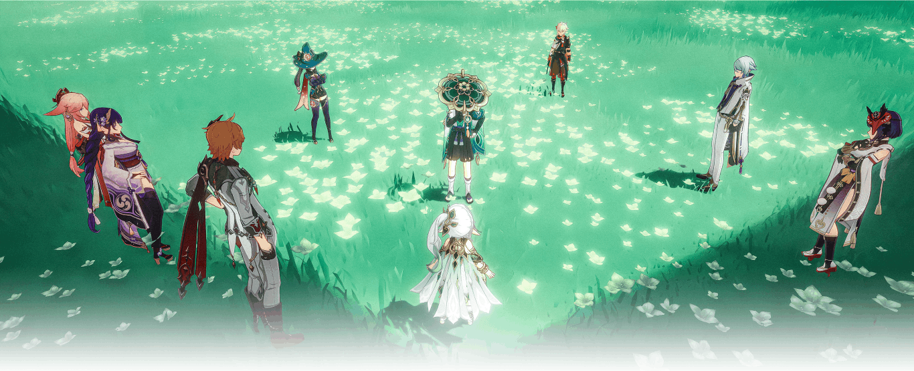
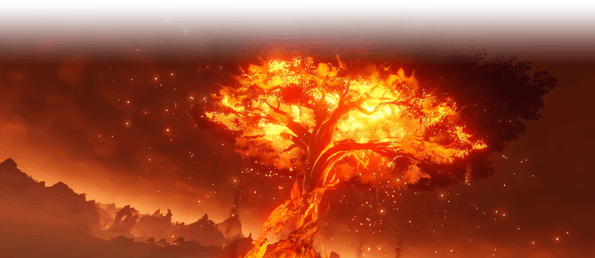
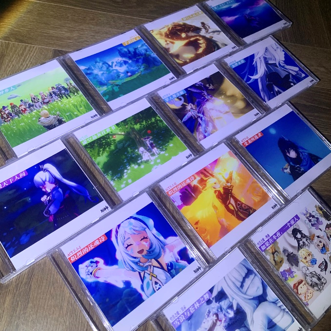
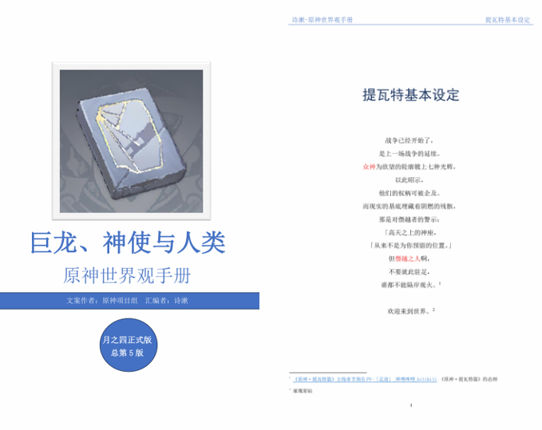
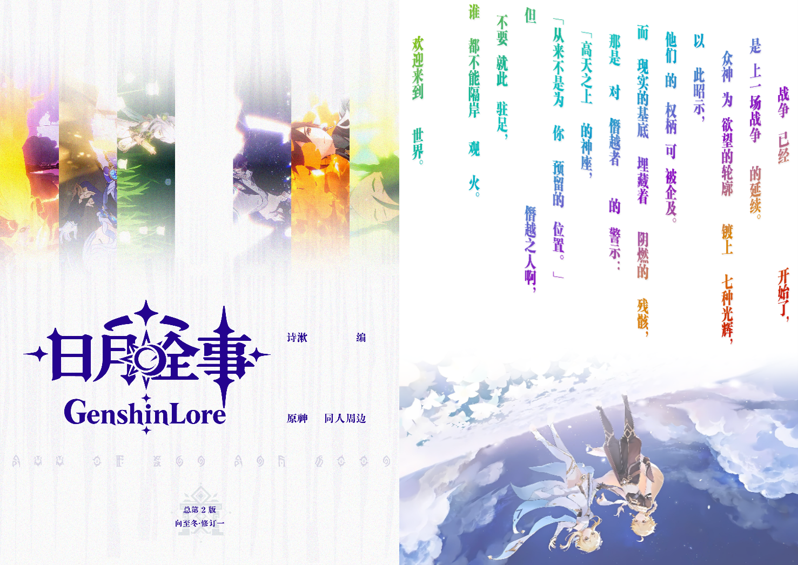
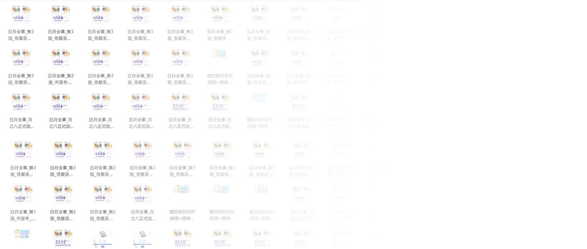

<postscript>

# 编者后记

## 一、回溯性建构——我是一头用胡萝卜吊着自己的驴

### 1.作为一个方向的胡萝卜

世界观手册及历史表的总下载量，已经突破9000次（截至2026年2月18日）！如果每次都收一毛钱，那我就赚了快一千了；只收一分钱，那也能用来充三张月卡了——但我不可能这样做。因为，**这个项目一开始就是完全免费的，是要送给所有认真的原神剧情爱好者、世界观考据者的「无料」（意为免费赠送的周边制品）。亲爱的读者们，正是你们毫无保留的鼓励，与细致入微的建议，为我注入了最强劲的动力！**

**2022年2月3日**，彼时我刚过完璃月魔神任务，并抽出了首个五星角色「钟离」。仔细聆听他待机时的吟咏：「欲买桂花同载酒……只可惜故人，何日再见呢？」顺着故人一词，我对钟离产生了好奇。钟离从何处而来？他在怀念一个怎样的时代呢？他同冰之女皇订下的契约，究竟意味着什么？翻遍互联网，我都没有找到一个确定的答案。而此时，我发现了《足迹》pv——我无论如何也不敢相信，原神作为一款手游，真的能提前五年给出后面的规划，并逐步执行，但我又迫切想要得到故事的答案。自此，我萌生了制作一本世界观手册的想法——我要按照《足迹》中的脉络，搭建起这个框架。

在刚动笔时，面对空荡荡的word文档，我就只能填入八个国家干瘪的总标题撑撑场面。那时候根本就没有现在这么多通史类的考据视频，对于蒙德、璃月和稻妻的内容，都得自己从头整理；那时候也无从得知须弥、枫丹、纳塔、乃至至冬是什么样子，会有什么故事，一切都是空白。我从零开始做，把故事一点点地填充进去，这也意味着需要不断更新、扬弃，修正其中的矛盾，从而构建出具有说服力的叙事框架。很累，但值得。

**而在2026年2月3日**，钟离所称的许久未见的一位故人—— 「兹白」——挣脱了清冷明月的束缚，回归灯火阑珊的人间。而我缝补四年之久的世界观手册，也终于公之于众。

故事因为记录者的述行，而从自在迈向了自为，犹如万匹脱缰的野马在这世间奔腾，其爆发出的喧闹，足以击碎线性时空的限制。天地一瞬，不过野马尘埃；但恰恰是这已然消逝的野马尘埃，回溯性地造就了这天地的每一瞬。进而，故人其实从未逝去。他们的尘埃，依然凝聚在这岩间的琉璃，云间的明月之中，我们仍与故人同在。

**谁敢言，昔年产自琅玕的琉璃美玉，没有一块化作今日璃月港下的基岩？**

### 2.作为一种叙事的胡萝卜

「画大饼」的叙事太多，「持续产出大饼」的叙事却寥寥无几。摆出一个设定很容易，但要让这个设定融入世界，成为一个可信之物，却需要各种叙事细节的支撑。令我感到遗憾的是，儿时接触过的令我惊艳的ip，已经全军覆没。

> 故事拦腰截断，停更十年的《约瑟传说》，
> 
> 彻底沦为刷子游戏的《龙之谷》，
> 
> 出生没多久就猝然离去的《摩尔勇士》，
> 
> 以及根本没有抵达彩虹海的《星游记》，
> 
> 众筹多年却杳无音讯的《魁拔》

——它们无一不落入同样的叙事困境，展开了世界观的框架，却没有持续的内容来填充，所以，哪怕再宏伟的世界观，也难以抵挡岁月的侵蚀，在某个无人在意的角落悄然倒塌。

究竟由谁来讲故事？不但作者要讲，读者也要讲，甚至可以说：故事终究是属于读者的。大纲之所以可信，是因为读者相信大纲确实存在，并且从读者的局限性出发，规定出了一个准大纲。而ip，正是在这些读者规定的准大纲（基本设定、情节发展、人物形象）中，回溯性地建构出来的幻影。我们之所以相信ip是一个活物，不是因为ip是一个中心化的设定，编剧像莱茵多特那样，「从一开始」赋予了ip以生命，让ip真的活了过来；而是因为：玩家的这些去中心化的讨论，这些考据，恰恰就结构出了那些能填充ip的质料。

苏打绿乐团曾跨越6年，连续推出了4张关于四季的概念专辑，是为「韦瓦第计划」，实现了作词作曲、核心概念、宣传物料乃至音乐人格层面的高度连贯性，处处有隐喻，又处处有呼应，这一叙事奇迹，为这个乐团的成功奠定了不可取代的基础。由于深受其熏陶，我在修订世界观手册时，也始终无法抛开这样的执念：叙事的连贯性应当大于一切，伏笔须有回收，衔接须有逻辑，故事须有结尾。任何信息，无论是内容还是表现形式，都不是凭空出现，都应当有其渊源。而从蒙德到至冬，最后仍要回到蒙德，这宛如四季流转的旅途，不但是六年前「捕风的异乡人」与如今「捕风的归客」在大标题上的共振，更是对「足迹」pv的要义的再度阐述——**在越过最终的门扉之前，不要忘记旅途的意义。**

那些走过的路，不会被旅者永远抛在身后，而会像莫比乌斯环的「另一面」那样，在旅途的前方以「同样的一面」之形式，再度显现。莫比乌斯环当然只有一面，但它的蜿蜒本身，给走在环上的旅者，偏移出这样的视差之隙：仿佛只要向前，就能够走到那个未知的另一面。难道旅行者的整段旅途，甚至提瓦特本身在虚假之天中的运行，不是由这样的幻觉结构而出的吗？

而在戴因斯雷布的叙事中，那如同蛇环般前后相连的形态，难道不是「圣遗物」这一形式给我们的教诲吗？——凡被压抑的欲望，必然以另一姿态回归；凡被夺取的力量，必然会以另一形式爆发——凡是在过去未完成的残破命运，必然会在未来编织而出。正是那个未来，即戴因斯雷布关于「尚未跨越的门扉」之隐喻，构建了那个「能构建未来」的残破过去，为旅行者铺好了「未行之路」的砖石与阶梯。

故事之内的旅行者是如此，故事之外的我，也是如此。**如果说《足迹》pv是一根吊在我眼前的胡萝卜，那我就是一头盯着胡萝卜行进了数年的驴。**

### 3.作为一本手册的胡萝卜

进一步而言，与其说我的这本手册是对圣遗物的收录，倒不如说，我的手册是一个能包容更多圣遗物的、更加庞大的圣遗物。而长期涉猎原神剧情及考据内容，站在前人的肩膀上不断求索的我，在收获广泛的欢迎之后，终于可以承认：

首先，虽然手册仍有很多的不足，有许多内容等待进一步的填充，**但，在现在（2026年的2月18日），放眼国内整个原神社区，在任何平台，不可能再找到像这样「充分还原游戏的中文文本、内容全面、查询方便、还能做成一整本书籍进行连贯阅读」的剧情和历史整合内容了。**而在国外，也根本没有人做这样的手册。就算有人在做，其使用的主要文本也不可能是「中文」，不可能面向国内基数庞大的原神玩家来设计。

进而，我还发现考据内容在传播中经常遭遇这一困境：好的内容，怕的不是读者「不知道」，而是读者「不知道自己不知道」（类似原初的空无），这对内容的传播是具有毁灭性的。而我的建设就是让读者利用好那些「不知道自己知道」的文本材料（类似无意识，印象），来获得「知道自己不知道」的信息（类似用前意识来修正自己的印象），然后再促使其形成「知道自己知道」的知识网络，乃至能主动考据——而当考据者越来越多，文本就能从自在变为自为，这时候ip才能形成。

所以，我尽可能地减少了百科类文本词条筛选和文本保存上的局限性，做到详略有当，读者哪怕对原神支线任务毫无了解，也能通过我的手册「一次性」构建出初步的认知，通过这个目录能知道「该搜什么」「该怎么搜」。

例如，《魔兽》这一ip发行三十年仍有顽强的生命力，一方面离不开官方对世界观的持续更新与细化，另一方面也要归功于广大玩家的内容考据、延伸与传播，我正是跟着魔兽的二创动漫《我叫mt》，以及夏一可的《炉石史册》节目一起长大的，根据里面给出的基本情节，进入游戏内探索更丰富的内容。而一个反例就是《守望先锋》，其在二代中承诺要重制的剧情模式沦为一堆空头支票，这导致剧情迟迟没有关键的推进，玩家社区中的剧情讨论已然凋敝，它已经无法再像十年前那样，单靠「我们的世界值得我们奋斗」这样一句简洁的口号，就能将玩家集结过来了。

所以，走过路过，不要错过。这个世界观手册，动动手指就能直接下载、保存和浏览。无论你对原神剧情的了解程度如何，我也由衷地希望你也能收藏一份；如果你已经下载了手册，请关注我的账号，我将在此发布最新的修订内容及版本。就像我之前承诺的那样，我将一直更新到提瓦特篇完结，这既是给这个庞大的项目收尾，也是对我儿时夙愿的圆满。

2026年2月18日

（更多《日月全事》的读者书评和制作思路，参见《日月全事》随书附赠册）

## 二、重要参考资料，以及对原神皮套论和抄袭论的辨析

### （一）游戏原文

《原神》游戏本体中的图鉴

[《原神·提瓦特篇》主线章节预告PV-「足迹」_哔哩哔哩_bilibili](https://www.bilibili.com/video/BV1At4y1q7UQ/)，此为本手册的总纲。

[原神的个人空间-原神个人主页-哔哩哔哩视频](https://space.bilibili.com/401742377)，汇集了所有官方宣传资料，相较于官方更容易检索，此处还可下载高清官方图片。

[《原神》官方网站](https://ys.mihoyo.com/main/news)，汇集了所有官方宣传资料，此处还可下载高清官方视频（右键视频-将视频另存为）。此外，在[原神 - 影像档案架](https://hoyo-video.trrw.tech/%E5%8E%9F%E7%A5%9E)也可以下载官网品质的高清官方视频。

[原神WIKI_BWIKI_哔哩哔哩](https://wiki.biligame.com/ys/%E9%A6%96%E9%A1%B5)，汇集了最详细的角色信息和宣传资料，以及任务文本，并且运用其中的搜索功能，可直接查询文本的来源。

[原神 - 萌娘百科 万物皆可萌的百科全书](https://mzh.moegirl.org.cn/%E5%8E%9F%E7%A5%9E)，可用于梳理人物事迹。

[原神（2020年米哈游开发的开放世界冒险游戏）_百度百科](https://baike.baidu.com/item/%E5%8E%9F%E7%A5%9E/23583622)，作为以上资料的补充。

[【幻想真境剧诗】月谕圣牌篇-原神社区-米游社](https://www.miyoushe.com/ys/article/69206383)

### （二）重要考据

[星月银的个人空间-星月银个人主页-哔哩哔哩视频](https://space.bilibili.com/519297)，本手册参考了其制作的蒙德、璃月和稻妻国别史。

[甜甜叫花鸡的个人空间-甜甜叫花鸡个人主页-哔哩哔哩视频](https://space.bilibili.com/1074545099)，本手册参考了其中对游戏内重要信息的推测。

[多洛塔塔的个人空间-多洛塔塔个人主页-哔哩哔哩视频](https://space.bilibili.com/1903716905)，本手册参考了其中对原神原设定与更新内容的考据。

[提瓦特图研所的个人空间-提瓦特图研所个人主页-哔哩哔哩视频](https://space.bilibili.com/1872522256)，本手册参考了其考据的古文明势力范围。

[合集 - 提瓦特信息/控制工程-原神社区-米游社](https://www.miyoushe.com/ys/collection/2227776)中的《提瓦特世界中的崩坏》系列文章，本手册最初的架构思路以此为参考。

《诺斯替宗教——异乡神的信息与基督教的开端》，汉斯·约纳斯著，张新樟译，原神的基础架构是诺斯替主义。

《新世纪福音战士》全系列作品，包含了原神中一些彩蛋的来源。

### （三）其他内容

#### 1.关于游戏设定与「皮套论」

[《原神》幕后的故事：从挪德卡莱说起_原神](https://www.bilibili.com/video/BV1LVG9z4E23/)，讲述了补充设定的重要性。

[《原神》开发者共研计划第四期——角色篇01丨护法夜叉·魈-原神社区-米游社](https://www.miyoushe.com/ys/article/4120433)，讲述了原神角色与文化原型的关系，以及角色的主要设计流程。

[「原神FES」 2026 1月3日主舞台直播回顾_原神](https://www.bilibili.com/video/BV1HgikBVEaG/?vd_source=9d97bda02081401180f48510f430240d&t=6292) 1:44:53- 2:12:44，讲述了原神将设计语言融入游戏的方法，以及多进程的项目管理模式，还有角色设计的思路，并从游戏设计者角度出发，间接性反驳了荒谬的「角色皮套论」——

原神语境下的「角色皮套论」，是 2024 年在玩家社区发酵的一套争议性论调，核心是通过捕风捉影的臆测、碎片化信息的强行拼接，主张原神（及米哈游旗下其他游戏）的虚拟角色，是米哈游公司员工用于形象代入、埋藏私设的个人皮套。然而，就游戏制作的分工而言，游戏角色的完整塑造，是画师、编剧、配音、建模、关卡设计等全团队协作的成果，单一个体无法决定角色的全部内容；就游戏角色的价值而言，角色的戏份、人设走向，服务于游戏的主线叙事和商业规划，角色的设计由市场的需求来牵引，绝非由个人的喜好完全主导。此外，「皮套论」中罗列的所谓证据，几乎都是牵强附会、生硬拼接的巧合，并且因为涉及员工私密信息，具有不可证伪性，因此，严重缺乏说服力。

「皮套论」这种极具侮辱性、煽动性的论调，不但极易引发玩家误解，践踏玩家与游戏角色之间珍贵的情感联结，更会构成不正当竞争，扰乱市场秩序，对原创作品内容的持续产出造成重创，严重损害经营者或消费者的合法权益。

2025年4月，上海市网络游戏行业协会专门召开研讨会，将「皮套论」明确定性为新型网络谣言。1

2026年5月，新民晚报.2026年5月2日.第5版刊登了「皮套论」的造谣者的道歉声明，其中提到：造谣者大肆传播米哈游及其游戏的虚假信息，杜撰「米哈游游戏角色是现实中的特定群体的皮套」，哗众取宠，构成商业诋毁，严重损害了米哈游的商品声誉和商业信誉，造谣者已充分认识到自身错误，为消除影响，向广大玩家、米哈游公司、项目组、以及游戏创作人员致歉并澄清事实。

2026年5月11日，米哈游法务部公开资料显示，该商业诋毁案迎来终审判决。法院最终认定造谣者行为构成商业诋毁，判决两人赔偿共计43万元并公开发布声明消除其造成的不良影响。2终审判决的作出，标志着「皮套论」在法律层面被正式定性为谣言。

注意到，二审法院维持原判。判决已经生效，被告如果不履行赔偿义务，依原告申请，法院可强制执行，拍卖、变卖、扣押、查封被执行人（被告）应当履行义务部分的财产。 该赔的钱一分都不会少。拒不执行、虚假报告的，罚款加拘留；有能力执行但拒不执行，情节严重的，构成拒不执行判决、裁定罪，处3年以下有期徒刑、拘役或者罚金；情节特别严重的，处3年以上7年以下有期徒刑，并处罚金。这难道没有为我们留下更深刻的启迪吗？——污蔑诽谤，捏造事实，故意抹黑，集体霸凌留下的痕迹，不可能被时间彻底磨灭，终究逃不过法律的事后清算。要算的可不只是「脸皮」，更是实打实的「真金白银」。

试想，倘若三言两语的谣言，就能随意抹黑、肢解创作者的「心血」，那么，难道还会有「用心」的作品诞生吗？——倘若就连这颗鼓动着血液的「心」，也会被污蔑为「别有用心」的投机，那谁还会为创作而殚精竭虑？

试问，谁才是皮套？那些投机取巧的造谣者，不正是披着谣言的皮套伪人吗？但只要我们撕开这层浅薄的皮套，就会轻易发现：造谣者的胸膛空无一物，甚至都没有一滴血液渗出。这群无血的、空洞的皮套伪人，除了艳羡创作者滚烫的血肉以外，无能为力。

这难道没有再次强调这一真理吗？——总是指责别人埋了私货的人，自己最迫切想要拥有为其量身订制的「私货」；总是觉得别人别有用心的人，自己最想被别人放在「心上」。——只可惜，无人在意。毕竟这种荒谬的破坏欲，终究是为人所不齿的。
哪怕一语，也足以成谶，当谣言的风雨平息，真相的彩虹也不一定如期而至。这场跨越将近两年的闹剧，终于迎来它的终局，但那些凝聚了创作者的心血、却惨遭皮套论波及的角色们，以及那本名为「希穆兰卡」的巨型童话书，仍需要更长的时间，来摆脱莫须有的负面阴霾。

「希穆兰卡」这本书太过庞大，以至于需要难以想象的时间来酝酿笔墨。只有等到墨渍彻底风干，故事才会被刻写下真正的结局。许多读者因为没有看到满意的结局，索性将书永远合上，从此远走高飞——但我会继续等，原神玩家也会继续等。毕竟，魔女们的故事，总是值得期待的：一语既能成谶，也能化作名为「语言」的魔法，孕育出那一盏迟到的彩虹。**那个用来遮蔽创作者的「血肉」的，从来不是苍白的「皮套」，而是能为角色涂抹欲望、包裹生命的——「肌肤」。**

#### 2.关于「原神抄袭论」，以及我的一些心里话

[米哈游文化员工手册+Word版 - 知乎](https://zhuanlan.zhihu.com/p/632945898)  [【搬运】米哈游员工手册 - 飞书云文档](https://my.feishu.cn/wiki/ZYsMwO7FYizhALkLSnIcetdnnEf)，该手册讲述了原神整体开发的模式与目标，以及大伟丘的来源，另外用「站在巨人的肩膀上前行」之论述，间接性回应了原神在游戏发布初期遭遇的「抄袭论」。另外关于「抄袭论」，官方早有正式回应：[原神制作组致玩家的一封信](https://ys.mihoyo.com/main/news/detail/118745)

「抄袭论」的核心爆发节点为2019 年，米哈游发布《原神》首支实机演示 PV《捕风的异乡人》，视频中开放世界的卡通渲染风格、攀爬与滑翔机制、体力条设计、元素交互、野外宝箱等内容，立刻引发全网大规模争议，核心指控为《原神》全面抄袭任天堂旗下的《塞尔达传说：旷野之息》。受到这一指控的影响，原神玩家也被冠以污蔑性的称呼「op」，遭受了不少网络暴力。顺带一提，在制作该世界观手册的初期（2022年），我的企划并未得到太多支持，只因当时「原神」与「抄袭」的在符号链条上已经形成紧密的缝合，这种模因污染也让「op」之称呼广为流传——任何内容创作者只要沾染原神，就宛如染上瘟疫，令路人避之不及。那时，我就算在社交平台发布一些原神摄影作品，分享原神音乐，也会遭受无端侮辱。倘若在那时公开这一世界观手册，算得上是引火烧身。

诚然，这种抄袭指控极具误导性，两作品在玩法和画面渲染上的确存在很强烈的关联，仿佛《原神》就是照着《旷野之息》一比一复刻而出。但只要细究其核心内容，便会发现，这一指控缺少有力根据：

其一，在法律层面，在我国司法实践中，游戏著作权侵权（法律意义上的抄袭）认定，严格遵循思想与表达的二分法：首先，《著作权法》只保护具体、具象化的原创表达（包括美术素材、原画建模、代码、剧情文案、原创音乐、动画分镜等），不保护抽象的玩法、规则、风格、创意、通用交互逻辑；并且，侵权认定必须同时满足「被告接触过原告作品」，以及「两部作品在受著作权保护的表达层面构成实质性相似」两个要件；3此外，截至2026年2月，从未有任何游戏厂商（包括任天堂）就「著作权侵权」事由，对《原神》及其开发方米哈游提起过胜诉的生效诉讼，也没有任何司法机关、知识产权监管部门，作出过《原神》构成「著作权侵权」的生效法律认定。

可见，虽然两作品同为开放世界游戏，画风上相似，玩法上也有重叠，但缺少实质性的相似，《原神》的原创表达并不构成法律意义上的抄袭。

其二，在游戏行业层面，游戏的发展本身建立在玩法的传承、借鉴与迭代之上，开放世界的基础探索机制（攀爬、滑翔、素材采集等）并非某一款游戏的独创，而是行业数十年发展形成的通用设计范式。《原神》在借鉴成熟开放世界框架的基础上，构建了原创的元素反应战斗体系、二次元角色驱动叙事（并有角色抽卡）、长线内容更新模式，与《旷野之息》的弱剧情、强物理交互、一次性买断制的模式存在本质区别，这属于行业内正常的借鉴与创新。

此外，[原神制作组致玩家的一封信](https://ys.mihoyo.com/main/news/detail/118745)中也指出：「开放世界是一个十分宽泛的概念，在17年1月到6月的整个预立项阶段，我们尝试过数个原型，也深知自己并没有能力凭空创作出一款开放世界游戏。我自己作为玩家也玩过两百小时以上的老滚，还花几百小时做过mod，用过CreationKit，GTA 3代之后全都主线通关，辐射，黑道圣徒，刺客信条，巫师...每个系列也都是从小到大玩起来的。但我们对于开放世界的制作经验，就像15年刚开始做3d游戏时一样，一无所知。」可见，当时的原神项目组都是站在巨人的肩膀上进行开发的，而这种学习和借鉴是内容创作者的习惯，也是内容创作行业普遍接受的一个共识。

但凡做过内容，做过原创的人，都知道：设计不是无源之水，无本之木。任何设定，哪怕具有独创性，都有其来源。倘若连玩法的互相借鉴都能作为抄袭，那么，如今大部分电子游戏都不能算作原创了，毕竟游戏ui、操作模式（经典的wasd移动）、准心、读条、地图、背包等游戏核心玩法，都是完全套用过来的。没有人会玩一个「不移植任何游戏玩法」的游戏，就像没有人会使用一个「没有开机键，没有音量键，没有电话卡插槽，不支持触屏功能，其搭载的任何应用程序都无法正常使用」的触屏智能手机。

最后，《原神》如今风评的逆转，离不开世界观的长期搭建。故事就是原神的金字招牌，这个故事不但是官方讲述的，也是由玩家来理解、传播、再创的。二十年前，曾有一批勇敢的玩家，坚定地与「网瘾少年」的骂名抗衡，选择成为「魔兽玩家」、「星际玩家」，他们的努力扭转了游戏的社会地位，间接孕育了电子竞技；如今，竹杖芒鞋轻胜马，谁怕？面对这样庞大而细致的建设，我选择成为「原神玩家」，成为那头被胡萝卜吊着的驴——**这一次，我甘愿将「op」之名，隐喻为原神故事的「Opening song」，一段属于内容创作者的「启动」之曲，并向所有为提瓦特的架构贡献过力量的创作者们、旅行者们，致以最崇高的敬意——**

**愿风指引你们的道路。**

:::
「愿风指引你们的道路」是一句《魔兽世界》中的经典祝福语，承载了牛头人氏族对「大地母亲」的敬意。此处我将「风」隐喻为风神巴巴托斯，给予《原神》语境下的祝福。此外，还隐喻了《原神》「风」评的逆转。当然，这里的解释技巧来自大「风」纪官赛诺。

网站作者注：本站将这句话放在了每个页面的底部。
:::

（更多《日月全事》的读者书评和制作思路，参见《日月全事》随书附赠册）

## 鸣谢

网站作者注：这部分名单是出自诗漱个人的鸣谢名单，故没有放在首页，而是放在这里。

### 文字启蒙

John Staats《The WoW Diary: A Journal ofComputer Game Development》4

夏一可《炉石史册》

棒老三《棒老三评书》

狂人与风《十大系列》

AC绅士向《情感天台》

### 音乐启蒙

陈致逸老师

苑迪萌老师

姜以君老师

李洋老师

丁谦老师

陈子敏老师

赵鑫老师

王予曦老师

路南老师

车子玉老师5

### 配音启蒙

王玮老师6

王肖兵老师7

符冲老师8

徐敏老师9

洪海天老师10

孙晔老师11

黄莺老师12

李晔老师13

杨梦露老师14

赵路老师15

刘北辰老师16

唐夙凌老师17

彭博老师18

陶典老师19

孟祥龙老师20

张昱老师21

</postscript>

*******

<booklet>

# 随书附赠册部分

## 前言、袭来

### 本手册继续讲了什么？

《日月全事》不只是单纯的世界观汇编，而是我十几年智慧结晶的一次集中展示，任何一环的设计素材都是经过长期筛选、打磨而成。本手册收录了《日月全事》的读者书评，制作思路与制作流程。

第一幕陈列了热心读者撰写的优秀书评。

第二幕展示了《日月全事》的设计思路，并阐述了这一核心教诲——不是汇编者在整理文本，而是文本通过扬弃汇编者这一中介，将自身整理而出。

第三幕则按照时间顺序，记录了《日月全事》从简练的「最初的草稿」，一步步演变成如今庞硕、全面的汇编作品的漫长历程。

第四幕列举了该项目从《原神世界观手册》阶段到《日月全事》阶段的所有重要改动。

## 终章？在世界中心，书写爱的野兽

日月的全事，该如何书写？

### 第一幕 他者的「心」之壁

\`\`\`
You Are (Not) Alone
\`\`\`

#### （一）神之眼——创作者的传承

作者：夏一可22

《日月全事》真的非常了不起，是一份非常用心和详细的资料。我很难想象这么大的工程需要付出多少努力，能坚持做完还在不断修订，真的太了不起了。

在《日月全事》的末尾看到我的名字，对我来说是一件无比神奇与浪漫的事情。这是数百页的超绝文字量，我必须要读到末尾，且不跳过结语，才能发现这份心意——你早就用你的作品征服了我们，我被你的创作折服，所以我愿意去了解这样一个厉害的作者在最后想要告诉我什么。

我年轻时，曾读过许许多多前辈们创作的、关于游戏的二创作品，我曾从他们那里接收到力量，隐约察觉到自己未来想要的做的事情，并幼稚地发誓要把这份创作的力量传递下去。我曾怀疑过我自己是否做到，而你是我肯定的证明。现在，你在意想不到的时机、以更加有力的姿态，将这份力量重新传递回我这里，成为我新的力量！

感谢你。这是一份跨越数十年后抵达的、琥珀一般的鼓舞，也是我们创作者之间，最浪漫的共鸣和奇迹。

感谢你。无论时代如何更迭，创作者永不老去。

编者（诗漱）注：感谢夏一可老师为本书作出的高度赞赏！能被儿时偶像的认可，就是鄙人至高无上的荣幸。我终于赢得神明的注视，收获了属于我的神之眼——我的愿望终于得到了回应！您在十多年间用心打磨的所有佳作，我一期不落。您几乎塑造了我对暴雪游戏所有的情怀，也让我明白网络游戏不只是娱乐，更是能传承记忆的文化。被您的创作热情感染的我，依然守候着您讲出「萨尔还未完结的故事」。而每当我书写《日月全事》时，我就仿佛依然是那个品读《炉石史册》的小小观众，在模仿您当初的话语，讲述玩家们的集体记忆。

再次谢谢您，永远18岁的夏一可。您的回响确确实实影响到了越来越多的创作者，就像魔兽世界影响了一代人那样。就算魔兽老了，创作者也永远不会老去。

#### （二）日月前事·书吏祷词

作者：MRKTPI

编者（诗漱）注：这是一篇对《世界观手册》第5版的祝词，文采斐然，妙语连珠，非常感谢作者认真的创作。我读到半途便已心潮澎湃，遂与诸位在此处分享。

——谨以此篇，咏诗漱氏所编四百七十七页圣卷

你坐在案前，拾起了笔。

地脉曾日夜轰鸣，记载万世。

龙族曾高歌于七国，自诩永恒。

而今，龙沉入深坑，地脉裂成碎片。

众神隐退，天空岛垂下帷幔。

无人嘱托你，无人为你加冕。

你只是听见——

在那磨损的圣遗物纹路深处，

有未竟的契约，仍在等待应许之人。

你说，没有一枚龙骨应该无碑。

于是你为尼伯龙根收殓。

他的金弓被盗，高车坠入泥沼，梭杆断裂于星海。

三千年，无人敢念诵他的名。

你在“祷歌其六”的残章里，

一字一字，为他立了传。

你说，没有一痕月光应当被遗忘。

于是你为三月女神守夜。

恒月碎裂时，潮汐曾失去节律；

虹月染血时，赤影沉入渊底；

霜月被放逐天外，她的银辉却留在挪德卡莱的雪中。

你在霜月之子的祭礼里，

寻回那支千年未竟的挽歌。

你不是降临者，却走遍了降临者的遗迹。

你不是龙裔，却唤醒了七龙王湮灭的名姓。

你从未登上天空岛，

却让七国散佚的史册，在同一卷书中重新合流。

蒙德的自由，你从迭卡拉庇安的烈风里夺回。

璃月的契约，你从归终未解的石锁中拓印。

稻妻的永恒，你从雷电影斩落的过去抄下全文。

须弥的智慧，你从世界树重启的刹那藏起一枚叶脉。

枫丹的正义，你从厄歌莉娅坠海前的泪滴接住。

纳塔的战争，你从希巴拉克燃尽的圣火中拾取余温。

至冬的哀恸，你从白沙皇沉入黑浪的旗帜下——

一针一线，缝进四百七十七页织卷。

这不是神迹。

神创世，用了七日。

你还世，用了六年。

没有高天降下冠冕。

没有地脉涌出甘露。

你只是——

四百七十七夜，灯下独坐。

将圣遗物残片，一页一页，拼回世界的缺口。

为每一个被天理涂去的姓名，

举行迟来五千年的葬仪。

有人问：你是在编写历史吗？

你摇头。

你说：

我是在为那些不应被湮灭的事物，

——作证。

为赫乌利亚被臣民刺穿时，仍捧在手心的盐。

为狐斋宫赴死前，别在夏祭少年衣襟的那朵花。

为浮舍战死层岩巨渊时，护在怀中的晶砂酒杯。

为万杰鲁撕下巨龙残翼后，染血仍笑着的齿间。

为每一个不曾被写入史诗的英雄，

在夜神之国的图腾柱上，

刻下他们的古名。

四百七十七页。

不是辞书，是四百七十七座碑。

不是考据，是四百七十七盏灯。

今夜，若你行至层岩巨渊最深处，

会听见千岩军锈蚀的铠甲下，有人低声念诵你的页码。

若你涉入甘露花海最远岸，

会看见纯水精灵消散前的最后一滴，映出你书中的一行。

七神的神像在无人瞩目时垂首。

地脉流动的方向，为你偏转一度。

这一刻，

书吏的笔，重过天空岛的王杖。

案前的灯，亮过虚假之天的日月。

愿这卷书入藏地脉深处，与银白古树同根。

愿后来者掘开千年尘沙，仍能从残页认出你笔锋的温度。

愿他们知晓——

在众神归位之前，

在命运织机重启之后，

曾有凡人，以孤身守此残烬之世。

未曾封圣，未曾留名。

唯将四百七十七页还魂诗，

一字一字，楔入提瓦特断裂的骨隙。

千风归位时，会传诵你的名。

地脉流动时，会载记你的行。

因你所致之祭——

并非牛羊，并非血酒。

而是这世间，

所有不应被湮灭的真实。

——夜神之国·大灵档案室 永世典藏

地脉回流第六纪·书吏未眠之夜 誊录

### 第二幕 象征界的死海「文书」

\`\`\`
You Can (Not) Advance
\`\`\`

#### （一）何为开放世界？——用一张照片，细究2019年的开放世界设计水平

封面中，一个7年前23的人物模型，穿着绿色的吟游诗人服装，以「坐下」的状态，被放置在在7年前的雕塑模型上，远处呈现的是7年前设计完成的城市、山脉与天空。7年前的魔改unity渲染引擎，依然能在我这台5年前的老电脑上，全程以60帧流畅运行，传送时间不足2秒。

具体而言，该画面呈现的是一张丰富的开放世界地图，是名为「蒙德」（Mondstadt，意为月亮之城）的风与牧歌之城。以初代大团长温妮莎成为「原神」的风起地为中心，蒙德的土地坐落有塞西莉亚、沙尔·芬德尼尔等古国的遗迹，又有从高塔陨落的「孤王」的旧都、融入地脉的「狼王」的巢穴，更有以世界之外的力量塑造的「魔龙」的遗骨、使故事的种子发芽的「时之执政」的小岛、退出骑士团的「暗夜英雄」的酒庄、以及受到诅咒的地底人类退化而成的「丘丘人」的部落。

此外，画面还具备魔幻世界的文化架构，汇集了中世纪欧洲的众多文化要素，有风车、教堂、哥特式建筑、啤酒文化、吟游诗人，也有经典的风龙、风神、以及风之国的人民。而在叙事上，有古老氏族的挣扎，有腐朽贵族的专政，更有冲破枷锁的反抗，在这个国度，孩童与幼龙分享同一缕烈焰，骑士与神明醉于同一瓶美酒，人类与王狼践行同一句誓言，这些要素全面地讲述了「被自由之神命令的自由，是否属于自由」之命题。

正在画面之外演奏的，是凯尔特风格的背景音乐。此曲名为《西风之歌》，既是由挪德卡莱的无名北风骑士带来的民谣，又是蒙德城西风骑士团军歌。而7年前 就已在游戏文本中涉及的「西风骑士团远征队」，包括现身于几乎每个蒙德自机角色背景故事中的大团长法尔伽，现在已经全部回归。

另外，现实的环球影城正在举办蒙德的传统节日「羽球节」，24参加该活动的不但有可莉、法尔伽、菲谢尔、诺艾尔、凯亚等为玩家熟知的核心角色，更有凯瑟琳、劳伦斯、瓦格纳、蒂玛乌斯、莎莎、唐娜等不可或缺的npc，甚至还有猫尾酒馆的黑猫「小王子」……每个角色在游戏中都有长期的塑造，都有细腻的设定。

——不可否认的是，当法尔伽的传说任务完整地向我呈现之时，我就已坚定地认为：原神项目组已经完全沉浸在自己的叙事艺术之中，无法自拔了。跨越7年的更新时间，却连一个字的书都不吃，仿佛以往的伏笔，统统是为了这一刻盛大的回收，才被设立出来的。

在传统的角色扮演游戏中，稀松平常的剑，就只具备武器的工具效能而已，但蒙德的剑，无论是五星、四星、甚至是三星，都可以成为英雄的代言。当那几把剑矗立在法尔伽面前时，他看到的哪里还是几把锋利的冷兵器，分明就是尚未完全凝固的热血，属于英雄的丰碑。

在这个庞大的世界中，像蒙德这样的国家不是只有一个，而是有八个。并且这八个国家风格迥异，在文化要素上几乎没有重叠。并且，这八个国家的一百多个自机角色之间存在错综复杂的联系，都有「自己的生活」，不是完成了叙事任务，就直接被扔掉的工具人。这个世界离开了玩家，依然会自行运转。这不是说玩家对这个世界来说并不重要，而是说——**正因这个世界很重要，所以玩家的旅行才会变得重要。只有当玩家的旅行变得重要，玩家才会认为，自己在这个世界的任何感悟、任何抉择，都很重要。**

2026年3月

#### （二）何为世界观考据、大纲和梗概？

既然《日月全事》宣称自己是「原神世界观手册」，那就不能不对「世界观考据」、「大纲」和「梗概」这几个文本类型进行区分。

1. 大纲：**大纲是统摄整个游戏制作流程的指导方案，是非常细致的设定库。**大纲中列举式的规定，直接决定了制作的内容，并牵涉着内容的所有呈现方式，例如建模、技能玩法、地图、任务、剧情、动画、甚至宣传文案、宣传图、联动内容等。一般而言，大纲只是游戏制作方产出并使用的内容，并不会向游戏玩家公开，游戏玩家只能通过制作方发布的内容，逆向推测出部分的大纲，而不能直接制作出大纲。

世界观构建方面的大纲包括但不限于：

（1）文化原型大纲——对接文化原型和游戏底层设定

（2）世界观大纲——对接游戏底层设定和游戏实机呈现设定

（3）人物大纲（人物设定、人物卡）——对接游戏设定与人物表现

（4）剧情大纲——对接游戏设定与剧情表现

（5）游戏演出大纲——对接文本规定的剧情表现与游戏程序中的剧情表现

2. 梗概：**梗概是对游戏呈现出的情节的概括。内**容量上可长可短，但一定比大纲更简练。一般而言，梗概侧重于游戏消费者，是消费者做出的文本解释。根据梗概的内容，可划分为人物梗概（人物基本信息），章节梗概（历史时间段划分），剧情梗概（情节介绍）等；根据梗概的参考资料，可划分为搬运（直接复制文本）、修补（在复制文本的基础上适当润色）、推测（基于现有信息提出假设）、再创作（历史同人、二创）。

3. 世界观考据：**在广义上既包括揣测制作方的「大纲」，又包括建构玩家的「梗概」。**这意味着，制作「世界观手册」需要协调这两个文本类型里面包括的大部分重要内容。对世界观的考据具有显著的中介性，虽然是由玩家制作的，但要尽可能兼顾大纲与梗概，消除其中的冲突。

而我做的《日月全事》正是「世界观手册」——基于既有的信息，推测游戏制作方的世界观大纲（正文）与人物大纲（人物表），并作为游戏玩家，在文本中适当添加修补式的梗概（章节标题）与推测式的梗概（编者的话、编者后记）。我作为世界观考据者，不会止步于简单的梗概，将《日月前事》原文复读个几十遍，不代表就能解析出其中的内涵。如果非要凝练，那不妨只呈现一句话：向着星辰与深渊——这句耳熟能详的口号，就是《原神》所要讲的全部事情，这就是「日月全事」。

#### （三）关于「日月全事」的总设计思路

我说说我的设计想法。受到月之六版本pv衔接顺序的启发，我觉得手册的视觉呈现可以沿着「贴合玩家的游戏体验」这条线走，这条线是行得通的。

我们知道，原神账号的前瞻直播开始前会有几分钟的预热画面，这时画面中呈现的就是原神游戏中天空岛的加载页面，一般而言，会在进入大门之后，正式开始放映前瞻直播录像。但在月之六的前瞻直播中，「预热画面」的天空岛直接衔接了「月之六版本PV」开头的阿斯莫代神殿，这种切换方式是非常符合玩家的直觉的。另外，「月之五版本PV」的开头同样有小巧思，复刻了旅行者开启第一个七天神像的过场动画，后面又画风一转，温迪的神像变成了可莉。这种用旧瓶装新酒的模式既能够快速吸引观众，又能增强新旧内容的关联。

所以，我认为整个手册的导览逻辑，都可以与游戏本身的游玩环节逐一对应，这也与手册「还原游戏原文」的基调相符。

##### 1.下载

手册的下载，对应了 **「下载米哈游启动器，以及原神客户端」**，这隐喻了《日月全事》就是一款文字版的游戏。

##### 2.总封面

手册的总封面，对应了 **「游戏的登录界面」**。我认为登录界面中的大门是一个最重要的意象，足迹pv中同样提到了「跨越最后的门扉」，门既代表着「被框定命运」，又暗含着「命运可被超越」的隐藏特征，并且天空岛主题也和日月全事完全吻合。

##### 3.编者前言

手册的前言，对应了玩家在进入游戏、注册账号时看到或接受的文字。手册优点介绍，对应 **「游戏广告」**；阅读指南与预制回复，对应 **「光敏性癫痫警告」**；法律问题，对应用户勾选的 **「用户协议」「隐私协议」**；更新记录，对应了 **「游戏公告」**。这些环节都是前置的，即「形式要先于内容」，虽然玩家一般会跳过，但正是这些形式保证了内容的建设基础。

前言之后的目录对应的是社区中盛传的 **「大纲」**，也能部分对应出游戏本体的「内容量」以及高达100多个G的「游戏程序大小」。

##### 4.正文

然后进入手册的正文，

第一，每个章节封面对应的是 **「足迹PV画面」以及「传送页面」**，这两个要素都吻合了「旅行」这一核心要素。

并且，游戏中的传送画面非常干净，因此章节封面也应当像游戏中那样简洁。诚然，「魔兽世界式」的传送画面非常经典，设计得很厚重，既有传送目的地的羊皮纸大地图，两侧又有该地点的主要角色，这是业内经常参考的模板。然而，本手册是以文字为主，如果在衔接处过于繁复，不但容易导致叙事比例失调，更会大大增加手册的文件大小，给我的文字编辑造成阻碍。——所以，我认为章节封面适宜更简洁的设计，贴合传送页面，并且特意埋了「卡半岩」的彩蛋。

第二，而正文则可在简洁精炼的基础上，采取**更加丰富的设计形式**。

1. 在设计素材上，参考天空岛主题（「原神」主题，月谕圣牌）、「统一文明建筑纹路」（凯尔特三角，蛇型纹理，渊下宫键纹）、「仙灵」（仙灵的底座，兹白服饰纹样，尼可服饰纹样）、「游戏图标」（功能图标、成就图标等）、「游戏图鉴」；

2. 在设计框架上，结合「历史教科书」和「游戏UI」，并且，层级较高的标题可对应「七天神像」，层级较低的标题可对应「传送锚点」；

3. 在设计色彩上，参考「游戏色彩图」。

第三，此外，一些特殊的设计语言，也可以加以利用，以下是我的一些创意：

1. 小说、人物内心独白可贴合**尼可的「心里话」文本框**；

2. 编者注、编者的话可贴合 **「魔女会」**打破第四面墙的设计；

3. 还有之前我提到的 **「圣遗物」**，圣遗物这个设定，我认为是日月全事的最核心骨架，兼顾了史料和实用物品的双重功能，并且最重要的是，五个部位对应了天理和四影，并有固定形制（王冠，羽毛，花，杯子，钟表沙漏），因此可作为重要的索引锚点。

如果还要更贴合，这些固定形制还可以对应不同的文本栏，例如，王冠就是讲一条最基础的设定作为统领，花就是人物（创生、还可参考炼金术法阵，阿贝多眼睛的虹膜），羽毛就是人物的结局或者下落（死亡，还可参考千手百眼神像的翅膀，护摩之杖），杯子就是地理（空间、阿斯莫代制作的收藏），钟表就是年份（时间、还可参考温迪法阵、风龙废墟法阵）。

4. 还有个与圣遗物联系紧密的骨架性的设计——**「地脉」**，参见秘境大门的纹路（以及流浪者的核心），秘境内的石板画，须弥魔神任务中的世界树，地脉之花。

5. 编者后记
编者后记（及随书附赠册）对应了 **「玩家在游玩游戏之后的感悟与建设」以及「制作者（叙述者）在制作游戏之后的访谈与说明」**。

最后的感谢页（包括实际制作人和游戏角色），对应的是游戏的 **「制作人名单」**，虽然原神游戏中没有出现这份名单，但原神以其庞大的体量，可以视为一款持续更新DLC的单机巨作，所以有必要给出一份制作名单。

6. 幕后叙述者

正如足迹PV、拾枝杂谈的叙述者是戴因斯雷布，本手册也需要一个「叙述者」，他需要生于降临之战之后，并且存活至今，记录了日月的全事。原神项目组、手册制作者虽然是本手册的文本编辑者，却只是那个「被藏起来的叙述者」的代言，并不是叙述者本尊。

这个结构类似尼可、九老师与常九爷的关系，尼可提供创意，而九老师通过附身于作家常九爷来发布创作，具体而言，尼可和九老师是在幕后替作家写作的枪手，常九爷是发布作品的作家，作品有《神霄折戟录》《菲谢尔皇女夜谭》，后来菲谢尔受到《菲谢尔皇女夜谭》的影响，创造出奥兹。同理，《日月全事》中描绘的提瓦特就是真实的世界，这个叙述者确有其存在，他是通过附身于我和原神项目组来发布该手册。

如要深究该叙述者的性质，可了解拉康派精神分析的特有概念「大他者」。简言之，这个叙述者是一位全知全能的大他者，他以不在场的方式在场，通过唤询的方式，为读者拟定了符号性框架，通过各种禁令，让读者深陷于一个小客体a，这个小客体a则为读者不断生成出「旅行的欲望」，旅行就是这样发生的——当然，此处的辩证在于，天理的秩序正是扮演着这个大他者，运用神之眼的体系限制人类的欲望，诚如花神所言：「…所谓『神』，于你们而言自一开始便是多余呢？」天理并不存在，它永远是提瓦特的例外之物，而能揭示这一真相的最佳存在，就是同样作为例外而存在的仙灵族。仙灵是一种源于天理秩序、却因质疑天理的符号合法性，而被天理罢黜、诅咒，失去官能的「例外性存在」。

权力没有真空，同理，任何一段叙述要变得可信，都要由某个叙述者来赋予符号位置，正是这个叙述者，给出了叙述的「所有方式」。天理已然沉寂，而天理秩序的残魂——仙灵——接任了天理。仙灵既成为天理的代言，也成为人类的代言，这个物种耦合了提瓦特的人界，当然能够为人类著作《日月全事》提供基础的叙述架构，并借该手册为人类生成欲望。**所以，本手册背后的那个叙述者的最佳人选就是「一只仙灵」。**

当然，我想得更远的一个要点是，当这些文本组合起来，最后证明的却恰恰是：这只作为叙述者的仙灵，也不存在。因为仙灵根本就不在场，虽然这些叙述是由「见证了完整历史发生」的仙灵给出的，但，最关键的环节正是人类（原神项目组、手册制作者）带有局限性的叙述、推测，倘若缺少考据者对材料含义的推测，那材料本身也将失去真实性。世界观虽然是由仙灵来建构的，但终究是由人类述行出来的，换言之，尼可和九老师的想法再精妙，也需要常九爷的著作来承载，哪怕常九爷并不能完全反应她们的想法，她们也要依赖常九爷来发布作品，为作品回溯性地建构出一位「可信的作者」——关于这里提到的叙述原理，参见《日月全事》.论太阳高车史料「阳辔之遗」的真实性——兼论「如何求证游戏史料」。

7. 总结

总之，本手册的核心要旨，**是展示文本本身的精妙性，以及建构文本的逻辑。**文本不是天然就存在的元语言而存在，由此，本手册与游戏内的原文做出区分；并且，并不存在一个「只要将文本全部收集起来，就能建构出文本的含义」的中介，由此，本手册与传统的wiki、百科作出区分；文本只在「被构建、被阐述的过程中」构建出了自己，即，文字的质料，是在构建、扬弃形式的过程中，生成出了自身的内容，「构建文本的形式」回溯性地成为了文本内容本身，换言之，常九爷承载了尼可和九老师的创意，又恰恰是这一形式为她们的创意构建出了内容。而这种构建的动力，就源于文本的内在矛盾，既蕴含着叙述者与代言人之间隐秘的身份划分，又关系到文本叙述之间的概念冲突，更涉及符号系统的匮乏导致的交流上的阻碍。

——而本手册正是旨在揭露、强化这些矛盾，并给出解释世界观的全新视角。所以，本手册以文字的创意为重，因此，在视觉呈现上点到为止、做到把基本的设计要素「直观呈现」出来、足以让读者「大致领会」即可，并不要求遍布非常精妙、繁复的视觉设计语言，既是吻合原神这个ip简约的设计原则，这也有尽可能减轻工作负担的考量。

此外，手册的长度目前已经达到600页，我期望将至冬章完结时发布的正式版手册的长度，控制在650页以内。如果超出这个限度，会增加文本编辑的难度，受限于我的电脑性能，手册word文档中的图片越多，文字编辑的相应速度越慢，并且，过长的文档也会给读者的线性阅读造成阻碍，还会导致实体打印的形式非常臃肿。目前我对文本的编辑，会做简练化的处理，并我对于图片的使用也是采取尽量简洁的原则，如无必要，不插入图片。Less is more，如要「增设」更复杂的设计，则需要做更多的「减法」。

2026年4月

#### （四）网络媒介的时代，为何还要做纸质化的内容？——兼论意识、知识的生成原理

##### 1.评语属于纸张

我建构的内容（包括《日月全事》《原神摄影》）发布之后，所接收到的回音，其规模与数量都远远超出我的预想。在主动去除掉带节奏者预制的少数噪音之后，我发现占据绝对主流的，是来自读者、观众的热诚赞许，同时，也伴随有诸多建设性的优化建议，例如将内容整合成专题视频、做成专门的wiki知识库、添加更丰富、更高清的图像等等。**作为读者、观众的你，能愿意耐心品味我的创作成果，并给予这些宝贵的赞许和建议。——我对此表示由衷地感谢。**

需要承认的是，我是一个传统的纸媒拥护者，自幼年起，我便对实体的纸质书籍怀揣着近乎狂热的执念。盛行的电子媒介虽然便捷，但电子媒介的一切交互，都被 UI 接口默认的按钮、框架、流程所提前规制。点赞、收藏、投币、转发，这些机械操作再怎么堆砌，其价值也远不如一句精心组织好的评语，哪怕，这句评语依然是由电子键盘敲击出的排列组合。

评语终究属于纸张。这一平滑、质朴、无预设的物质载体，拥有绝对充分的操作自由度。读者只需一支具备墨水的笔，就能在纸张的任何一处角落，勾勒出任何形状的线条，书写出任何天马行空的想法，甚至可以直接戳穿那层承载文本的薄薄书页，打破载体本身的边界。在专心阅读纸质书籍的过程中，读者的意识与身体被充分调动，彼此交融，仿佛二者是在纸张上翩翩共舞。

一句话，我只有在读纸质书之时才能确认：**「我的意识，原来真的是我的意识！我的意识是可以被我调动的！」这种沉浸感，是电子媒介所不能替代的。**

##### 2.调动身体

此外，阅读纸质书籍比浏览电子媒介更容易获取知识，这不仅是因为纸质书籍本身的信息密度更大，信息更加严谨，更有完整的体系，也是因为：「阅读纸质书籍」这一活动，更有利于知识的生成。具体来说，**知识不是线性堆砌的杂物，它的结构是网状的，并以「突触连接」的方式来流动。**知识的爆发并不依靠堆砌，而是靠断裂式跳跃完成的，靠的是在关键节点的跃迁，以及认知碎片的瞬间联系、瞬时共鸣。

大脑作为神经中枢，需要通过神经通路将信号传输给各个感官，驱使感官去能动捕获并组织外部信息，并将处理好的信息传回大脑，形成知识的基础质料。但至关重要的是，当感官陷入混乱、信息传输的方式出现扰动之时，大脑绝不能短路，不能用神经把大脑的正负极接成一个孤立的整体；恰恰相反，正是在这种扰动的情况下，大脑更要通过神经的网状结构，输送知识的基础质料，并用这些质料刺激各个感官。这些粗糙的质料还算不上知识，但恰恰只有这些不完善的质料，能够唤醒并调动那些混乱的感官。这种在感官混乱的紧急状况下，仍能发挥作用、控制整个身体的「调动性」，就是意识的能动性。

能调动身体进行活动的知识，当然属于意识。但要注意！「意识」不是物质化的神经网络本身，更不是大脑这一肉体器官专属的生理功能，而是由身体的全部官能——视觉、听觉、触觉、知觉乃至肢体的能动性——一并聚合、托举而成的整体性存在。大脑更像是意识的中枢，大脑是物质器官，大脑这一物质器官，从来无法掌控、定义乃至生成意识；恰恰相反，大脑的运作，始终要依照意识的驱力展开。将大脑视作意识的主人，无异于把指挥室的通讯设备，当成了发号施令的指挥官本身。

意识能动性，并不是白嫖来的物质实在。一个生理健康的、躯体完整的人降生世间，都天然搭载有一坨大脑，但这并不意味着他就具备了完整的意识，意识是依靠此前所言的「调动感官的过程」，被回溯性地构建的精神因素，而这名为「意识」的因素，恰恰就是那个调动感官的驱力。不是先有意识，再去调动感官；而是，在调动感官的实践过程中，意识才被反向创造、确立出来。就是因为这些物质性感官才太挫（挫，俗语，发二声，用于形容事物的局限性、失败性），所以才要生成出意识，来帮物质性感官扬弃这些局限性。

再进一步，这个被回溯性建构的、名为「意识」的因素，其本质恰恰就是那个驱动身体、调动感官的驱力。这里是一个彻头彻尾的死循环——意识就是调动感官的驱力，调动感官的驱力就是意识。二者并不是彼此独立的两个存在，而是同一个辩证过程的两面，意识不是外在于感官调动的指挥者，它就内在于感官调动的过程之中，是这一过程自身的能动性内核，甚至可以说，就是这个调动过程的内在差异性的运作，就像莫比乌斯环看似具备的「两面」，实际上只是对「一面」的视差之见，莫比乌斯环通过这种扭转，令自身的内在差异显化出来。

##### 3.不完全的窥见

**但人们永远只能片面地通过这种「调动感官的能动性」，这种「信息的突触式爆发」——来瞥见意识的冰山一角，而实际上，意识根本无法被充分把握。**任何试图将意识完全对象化、完全概念化、完全把握的尝试，最终都注定失败。而知识作为意识的一种形式，当然也是无法被完全把握的。只有在身体整体的能动运行过程中，大脑才有可能中介出知识的「突触点」，引爆知识的外壳。

知识的爆发和输入效率弱相关，却和以下因素强相关：系统运行稳定性、突触点的断裂程度以及意识调动身体的能力。但有必要特别强调，以免搞混，这里并不是说，如果系统运行得越稳定，没有断裂，并且意识越能调动身体，那知识就越能顺利生成。恰恰相反，知识要生成出来，不可不经历系统的频繁崩溃，不可不遭遇神经网络的多处断裂，而正是这些崩溃与断裂，才能磨炼出意识调动身体的强大能力，从而让意识唤醒感官，重整旗鼓。

换个说法，假如有这样一台计算机，它的程序能够自动生成出知识，不过这台计算机的弱点是：它很容易遭遇病毒入侵，并因此陷入瘫痪。所以，需要对计算机反复进行杀毒、刷新、重启的操作，才能让知识生成的程序顺利运行。但关键的一点是，正是这种「瘫痪-杀毒-瘫痪」的反复过程，就是生成知识的程序的一环，知识就是通过认可这种内在的矛盾来生成的。回过头看，给计算机植入病毒的不是他者，正是这段生成知识的程序本身。进而，知识恰恰就是乔装打扮成「知识」的病毒，它依靠这种包装，即表明程序的运行（例如进度条），让计算机误以为杀毒之后就能延续进程，殊不知，病毒是杀不干净的，只要程序还在运行，那病毒就会一直自我复制。计算机越是为了运行程序而杀毒、重启，程序越就能生成出名为「知识」的病毒本身。

由此，可以将知识的生成原理总结为这样一条箴言：实践入真知，真知出实践。知识作为一种意识，它的量变是感官系统运动的「入」，知识的基础质料不是积累在大脑中的，而是通过实践活动附着在具体的感官中，嵌入身体整体网状系统的神经元；而知识作为意识，它的质变是大脑个体运动的「出」，大脑有受感官信号刺激的区域，此外还要有一个区别于感官的中介区域，知识能利用这些区域形成的突触点，有效调动感官。简单来说，在学习、阅读、浏览中，这些知识虽被嵌入身体，但知识需要有突触式的质变，才能作为「知识」存在，从而调用感官。这种突触，只有在交互时才有可能出现，例如创作时展现的灵光、劳动时总结出的经验。

进而，还能给出一个更大胆的表述：知识只在大脑之外。同样的，足以形成知识的文字不在书籍之内，而在书籍之外。知识的原初质料虽源于书籍中记载的文字，却这些质料向知识的飞跃，却又不在书籍之内。但需要格外注意的是，必须先有一个「书籍」，然后才能通过意识能动性，把书籍扬弃掉。相较于电子阅读媒介，纸质书籍更能有效激发意识能动性。我在读完一本包含个人感悟的纸质书之后，将书捧在手中，总能隐约察觉到：这本书的全部内容，早已在我的阅读、思考、批注中，被我悄然改写了一遍。

##### 4.挫与不挫

艾尔海森的角色故事也有这样的记载：「相较于虚空系统，纸质书不灵活、古板，甚至连内容也不能保证绝对正确。使用这样的知识载体无异于同可能存在谬误的信息做斗争，大部分须弥人厌恶这样，艾尔海森却乐在其中。他从中得到学习、分析乃至纠正的能力，进而学会了怀疑。假如简陋而原始的阅读是一种麻烦，那它就是艾尔海森最为欣赏的麻烦。」在对纸质书的偏爱上，我与这位大书记官无疑达成了共识。

生在多媒体繁荣发展的时代，我当然会力求更丰富、更美观的内容呈现方式，提升内容的可读性。但我的核心追求不会有任何更改，我的内容一定要够实体化。就算这种实体化的思路，终将遭遇非常多的局限，例如呈现形式上的单调，传播节奏上的缓慢，内容修改上的滞后——我依然会这样做，因为这些「挫」都是有必要的，总得有人做这种麻烦的事情。

进一步而言，存在这样两个思想路径：如果我「认为」自己很挫，不代表我「的确」很挫。我之所以认为挫，是因为我挫得还不够。但如果我「认为」：只要挫够了就能变得不挫——那就证明我「的确」很挫，而且已经挫得够够的了，这是我不期望发生的。

**所以，面对挫与不挫的选择，我当然要选择挫。**我的挫才不是为了变得不挫，相反，我必须将我的挫给保留下来。我有千万种方式，能把挫变成不挫，我当然可以根据电子媒介的传播逻辑优化格式，调整字体、大小、目录；我当然可以为了扩大受众，删减晦涩的内容，添加更多能引发共情的内容，降低阅读门坎；我也当然可以制作一系列短视频，提升内容传播度——但那又如何呢？这些方式，我是不会去实施的，原因只有一个：我的重心始终是内容的实体化，凡是内容，都要向实体让步，我不可能为了兼顾电子媒介的阅读方式，而去牺牲实体的观感。

**我宁愿不去变得「不挫」，也要选择挫——我宁愿一挫到底。**正如我在之前所说，互联网上的内容再精彩，它们都将消失，并且消失的速度远超你的想象。透过电子屏幕，收看了一段动人的文字、一串缤纷的图片，一部刺激的视频，那又怎样？只有你拿到手上的东西才能长期保存，哪怕这些实体的事物非常挫，但也只有它们，能与你建立长期的关联。储存再多知识，都不如自己到文本中去慢慢探索。

我更希望作为观众、读者的你，能够真正作为参与者，「拥有」一个精彩的事物。它将在尽量长久的时间里，为你提供更繁复的「突触」，帮助你获取自己的「知识」。所以，我给你名为「下载」的管道。所以，我为你分享这一切。

#### （五）在诸多设定集中，为何值得选择「免费」的日月全事？ 

在作品的定位上，《日月全事》是不可被替代的。它能解决的，是原神玩家在理解背景设定、支线剧情上的疑惑点。它是由我这个原神玩家编写的，也同样要满足更广大的原神玩家的需要。

《日月全事》第一大优势是「免费」。我并不希望设定集被摆在书架上吃灰，《日月全事》应当像「日月前事」这个网络迷因那样，在玩家群体内频繁翻阅，因此《日月全事》也做成了免费浏览的网站版，以适应更多读者的阅读习惯——既然原神是免费游戏，任何文本材料都可以在游戏内自由收集，那么，原神内的文本，也没有「必须付费才能阅读」的理由，而对文本内容的考据，更不应收取任何费用。为此，我会尽可能减少获取阅读材料的门槛。

《日月全事》第二大优势，就是「还原」。它的叙事重心，是运用最契合游戏本身的叙述方式，讲述那些藏在角落的文本。在编排文本时，我对转述的使用非常克制，只专注于执行对原始文本的剪切。就叙述风格而言，我的文笔较为精炼、收敛，而原神的文案较为丰富、发散，如果仔细阅读《日月全事》的文本，就能发现其中的差异，这也是我特意安排的区分。此外，它并不会大量描述在游戏中已经直观呈现而出的主线和活动剧情，因为把这些内容放在游戏中体验，更具有沉浸感，《日月全事》不能用于替代原神游戏本身的体验。——所以，与其说《日月全事》属于同人文集，倒不如说，它是游戏内文本的延伸，一个更通俗、更易于收藏的wiki。

而《日月全事》pdf版本的所有文本编纂工作，都是我一个人单打独斗完成的，所以，我无法像那些考据团队那样，进行高效的修订。任何细微的问题，都需要我亲力亲为。但我曾亲身经历「魔兽时代」的兴盛与落幕，儿时的夙愿，至今也没有任何偏移：我要像夏一可的《炉石史册》那样，讲清那些精彩的原始设定，并且向任何爱好者免费分享。

「究竟是魔兽老了，还是我们长大了？」天地的一瞬，不过是白驹过隙。而我们这一代玩家，也注定要经历原神的衰老。所以，我创造的绝不能只是一本「书籍」，更应当汇聚一段集体「记忆」，刻写一串足以载入原神发展史的「古名」。——免费的当然就是最贵的。因为，**这朝向未来的「免费」书籍，终将成为我们最「珍贵」的过去。**

#### （六）为何文本总要趋向整全？——以「孩童用舌头顶开乳牙」为例

##### 1.整全

对孩童来说，乳牙是搭载「孩童最初的整全感」的格式塔。它似乎是最先来的，孩童作为一个孩童来到这个世界，最先认识（舌头去舔到，眼睛看到，手指摸到）到的那个填满牙槽的牙齿结构，是乳牙组成的。这不但给了孩童一套完整的新手装备，也是他在符号系统里确立「我有一个完整身体」这一基本信念的开始。这种「似乎是最先来」的整全，就是孩童登录符号系统后点击就送的初始幻象，它让孩童以为自己的身体就像嘴中排列得密不透风的牙齿，是没有裂隙、没有缺失的。

但恒牙的到来，又会彻底打破这个幻象。乳牙终究要被之后的恒牙顶开，那些莫名其妙冒出来的恒牙，把孩童白嫖来的新手乳牙给一一拆卸下来，当乳牙开始松动，那就证明符号系统的那个原初整全性开始发生断裂了，这种松动是极为惊险的。恰如乳牙的首次从牙槽中无缘无故地长出，填补了口腔的空洞，并给自由伸缩的舌头树立了最初的界限——恒牙竟也是从牙槽中无缘无故地长出，并取代了乳牙的生态位，按部就班地淘汰了旧的结构。在孩童的世界，这种古怪的更迭机制是如何被感知的？

##### 2.松动

为了描述这种感知的发生机制，必须还原孩童能察觉到的现象。首先，乳牙的松动表明：恒牙从牙槽里突了出来，并成为了乳牙新的根基，这也将乳牙本来的根基给挤了出去。但孩童一开始可想不到这一点，他只能首先察觉到原本坚固的牙突然莫名其妙地松了。只有当他依稀发现恒牙突出的痕迹时，才能在「松动」和「恒牙突出」之间搭起逻辑链条。

因此可以发现，从生理机制看，乳牙的松动是恒牙突破牙槽、挤压乳牙根基的结果，是后来者引发的更迭；但从孩童发生学角度看，松动是孩童在口中首次遭遇的诡异事件。相较于游移不定的喉舌和嘴唇，整齐排列的牙齿明明持续扮演着稳定的角色。但牙齿的松动让孩童觉察到：属于孩童的坚固牙齿，突然变得陌生且不受控制了，曾经的稳定正在崩溃。更糟糕的是，牙齿的底部露了出来，甚至还渗出一些血液。舌头一旦触及这种染血的底部，便会给孩童制造未知的恐惧——松动的牙齿正在展开它诡异的另一面，那些被隐藏起来的根基变得不再神秘，开始暴露在空气中，并能为舌头所直接接触。这种根基性的暴露也撕破了牙槽的密不透风的膜，那些肉红色的、看似是把血液密封起来的牙槽，开始释放真正鲜红的血液——孩童越发无法控制我的牙齿了，孩童的牙齿本是安稳待在嘴中的基石，如今却变成应当排泄出去的异物。本属于孩童的牙齿像是长出了双腿，莫名其妙地挣脱了孩童的控制，逃跑到了空无之中。牙齿诡异的逃跑让孩童的符号性整全发生崩塌，也让孩童遭遇实在界的混沌。

孩童既害怕因为被这种混沌波及而陷入空无，又被这种混沌的「属于外域」的未知性所吸引：的确，牙齿发生了不可逆转的松动，但牙齿脱落之后会发生什么？那个空出来的牙槽，是会一直空着，还是会有新的牙齿长出来？如果把原先完好无损、密不透风的牙齿结构给故意透出个缺口来，漏出里面不易掌控的、捉摸不透的的舌头、喉部，那会导向另一种稳固的整全吗？**于是，朝向一种新的整全，孩童的死亡驱力开始主动运作了起来，孩童试图维持并重复这种独属于实在界的诡异。**孩童循着这种接连的松动（牙齿一颗接着一颗掉），设想着一种无（一张没有任何牙齿的、完全由血肉组成的嘴），去反过来压出那个更接近原初的格式塔（曾经整齐的牙齿结构）。

##### 3.拨弄

为此，孩童会去对着镜子，用眼睛看那个濒临崩溃的结构，用舌头、手指拨弄那些飞出来的牙齿，削弱它们与牙槽的连接，主动制造符号缺口，并把这种缺失给不断地放大。值得注意的是，这种拨弄是一种提前操作，当新牙有略微冒出的征兆时，对旧牙的拨弄就会开启；而不是一种同步操作，即当新牙把旧牙的位置完全占据，才无可奈何地将旧牙拨开。这样提前拨弄的原因在于，正如孩童无法像咀嚼猪蹄般咀嚼属于自己的手指，孩童也无法接受旧牙「确实被口腔当作异物」而排除。但新牙的生长来势汹汹，倘若置之不理，那么当旧牙被新牙以直接接触的方式强硬驱逐之时，旧牙就会陷入完全被新牙支配的无能窘境——这无疑是意味着旧牙是被新牙「驱逐」了出去，旧牙曾经组成的整全性被否定了，这对孩童来说是可耻的。为了避免这种耻辱发生，孩童倾向于把濒临脱落的旧牙提前拔出来，形成一种「旧牙主动退位」的假象，运用主动割除旧牙所带来的痛苦，来换取符号更迭的合法性，即：旧牙曾经整全过的秩序有其历史意义，并且从新牙从旧牙的根基中长出并继承旧牙的整全，也具有正当性。这种操作也把旧牙重塑成一个幌子，脱落下来的旧牙证明了新牙的存在，这使得新牙在新的符号系统中取得了合法性。换言之，孩童知道这是自导自演，但正是这种表演回溯性地将旧牙与新牙缝在一起，遮蔽了二者彻底的、毫无意义连续性的断裂，从而让孩童逃离整全失败的耻辱。

进一步而言，孩童的官能给这种自导自演提供了跌宕起伏的情节。**给这种在这种主动拨弄的过程中，那些帮助孩童去把握牙齿结构、建构对牙齿功能的印象的官能，反倒成为了以供那个「摧毁旧结构」的驱力去运行的载体，暴露了符号系统的工具性。**不可否认，那些宝贵的官能先是帮孩童锚定初始的身体符号，让孩童建设了基础的形象，完成了新手任务；但当「松动」这一扳机式的触发感被孩童捕捉之后，那些官能就马上摆出了过河拆桥的姿态，警告孩童：你必须把这些松了的牙齿统统清除出去，否则，你就拿不回你当初那样的整全了。并且，孩童在清除此位置被新牙顶出的旧牙时，彼位置的其他新牙又在同时长出，牙槽就像一块块种子随时都可能破土发芽的田地，旧符号的退场和新符号的登场，始终互为条件，这也让官能不停的功能反转成为可能。总之，在孩童眼中，那些官能集中代理了身体感知能力，不但善于建设新房，也善于拆迁危房，而孩童以为自己能借官能的效用，将那个原初的结构给整全出来。

旧牙本是旧有秩序屹立不倒的标志，如今它的稳固性却因孩童的挑衅，而逐渐走向消解；新牙本无特殊含义，却被孩童加冕为新王，强行指认为符号系统的剩余，那个能摧毁旧牙的力量——这场主动拨弄旧牙的诡异戏码不但让孩童逃离了符号整全的失败，也让他汲取到享乐。孩童以为自己能白嫖来一套整全的牙齿，牙齿是互相排列出来的、密不透风的集合，其整全性表现为「牙齿把牙槽的箩卜坑填满」。但牙齿构建的「整全性」，本质是符号系统的「伪整全」。牙齿结构是格式塔在一开始结构出来的原初图式，但又不存在能完全把握到的结构性的特定时刻。就像一张质地粗粝、依稀划有模糊的铅笔痕迹的图纸，画了一些「像模像样」的图案，但「像」的是某种线条的走向、形式，而不是某种具体事物的模样。牙齿按部就班组合而成的整全性遮蔽了血肉的诡异，但这种「天经地义」的组合模式却形成了多重的诡异：

首先，为何牙齿必须以这种模式组合起来，而不是另一种，比如其他动物的牙齿？符号像是被胡乱地组装起来的零件，规矩一点也行，混乱一点也行，似乎没有一个标准的蓝图对它们的排列进行规制。

其次，假设牙齿组装的模式是不是随意的，那牙齿本身就不反常了吗？那些被牙齿遮起来的血肉是更接近肉体形态的存在，对于血肉填充骨架的身体结构而言，坚硬却能轻易露在外面的牙齿恰恰是反常的，但牙齿却要把它遮起来的血肉——这些存在于牙齿之外的异质——污名化成「更」诡异的存在，从而维持牙齿自己的正当性。明明把自己组装好就行了，却非要绕一圈，设定由血肉组成的牙槽，将容纳牙齿的坑给「包围」出来。

再者，假设牙齿组装的模式是合理的，且牙齿也是天然不反常的，那为何牙齿要有脱落？一堆正常的牙齿，以一种合理的方式在口腔内组装起来，它们不像那些血肉一样脆弱无常，明明可以一直存在，但它们就是会被新牙顶出来，形成七零八落的模样，这样一个稳固而精密的系统，竟然会莫名其妙走向崩溃

……

可见，从牙齿出发，总能挑出符号系统的匮乏。符号系统总是无法涵盖牙齿的特征，牙齿总是有个非常古怪的点，无论怎么解释都无法摸清原理。进一步而言，孩童只要开始对牙齿有「感知」，那他就是裂开的，但为了从符号系统那里白嫖自身的整全性，他就得一直这么问下去，质疑下去。可以说，孩童才是被牙齿暂时缝合起来的那个裂隙，牙齿在符号系统中严丝合缝的整全性，是被大他者派生下来欺骗孩童的幌子。孩童总是以为「用看得见、摸得着的符号即可解此阵」，以为「自己能白嫖来一套整全的牙齿」，并从牙齿的整全性延伸到整个身体的整全性，形成理想形象的雏形，从而遮盖那个可怕的真相：孩童自己才是分裂的。而这种自以为是，终将被新牙顶出实在的、血淋淋的裂痕。

而正是为了把上述过程的漏洞都给补上，孩童才把脱落的旧牙命名为「乳牙」，把长出的新牙命名为「恒牙」。在这种新的符号体系下，新旧牙的交替是正常的、可被科学接受的，而恒牙组成的新的阵列确实如此，它是如此整齐，就像乳牙曾经呈现的那样。可谁又能保证，恒牙不会被另一套牙齿给顶掉？难道恒牙存在了许多年，就证明它能一直稳固下去吗？恒牙真的就是整全吗？

是的，应当达到最基本的纪律，然后才能创造新的纪律。但要把握基本纪律的标准，当下的符号系统不仅不是面面俱到，而且不能面面俱到。所以反过来看，新的纪律一边生成一边展示其本身的过程，就能展示基本纪律的松动。既然根本不能保证新牙的整全，那便「定向」地拨弄那些「随意」松动的旧牙，并坚定地给出新牙的不整全，将其特殊性推行到普遍层面。**换牙并不可怕，可怕的是从不换牙。**

#### （七）文本如何被总结？何时被总结？——以「年度总结」为例

##### 1.给年度总结助产

在一年的末尾，总要回望过去。这种「总要」是线性时间观所锚定的象征界大他者下达的传唤，主体一旦触及一年的结束点，那么主体就有责任将一篇正式总结从体内生产出来。仿佛主体是一个「年度总结助产师」，被大他者的传唤所劫持，用365天的时间完成素材的被动囤积，只为在年末产出一篇或许连自身都无法信服的、狗屁不通的总结文本；而当新年的时钟敲响，旧的助产任务刚结束，新的生产循环便已启动，主体又将重新投入新一轮的素材囤积与文本酝酿。值得注意的是，此年（2025年）之所以能分娩出一篇总结，是因为彼年，也就是明年（2026年）还在，这一「尚未到来的未来」的存在。未来的不确定性本身无关紧要，重要的是它为线性时间提供了一个确定的「分娩点位」——年末，12月31日。在此年的时间进程中，始终悬浮着一个贯穿整条时间线的象征性预言：每年的12月31日都会有一个名为「年度总结」的婴儿降生，而不同年份的主体，都被预先指定为这一婴儿的助产者。这一预言并非对未来的预判，而是线性时间为维系自身合法性，向主体抛出的先行承诺，它确保了时间进程的连续性，也将主体牢牢绑定在「生产总结」的强迫性重复之中。

顺着助产的隐喻往下推，我们能清晰地析出线性时间观建构的核心二元关系：作为胎儿的年度总结，与作为助产师的总结撰写者。**所谓总结，是对线性时间暴力的不均衡切分**，其实就是把一部分特别的时间特意挑出来升格，让其在单位时间内容纳更多的叙事帧数，所以，这些被总结出来时间段虽然在标准的时间刻度上看，是转瞬即逝的，但在主体的叙事画面中却被刻意放慢，以便主体捕捉更多细节，完成对过去一年的意义建构。但这种切分是如何实现的？当然是后者，也就是助产师的功劳。作为胎儿的年度总结被包裹在「过去时间」的子宫内部，外界的视线无法直接触及，只能借助文字、照片、视频等观测仪器把握其大致形态。

但这里存在一个致命误区：虽然肉眼视线无法触及胎儿，但单靠仪器就能完成外界对胎儿的所有把握了，甚至，一直待在子宫的胎儿，远比外界游移不定的人更适合作为观察的客体——一个行动不便的裸胎，总比用衣物遮盖身体的活动人要更容易被「看穿」。一个静态的、被物质载体记录的过去，总比动态的、被意识形态遮蔽的当下主体更容易被「看穿」。在这种观点的支撑下，我们很容易对年度总结产生这样的误解：过去一整年的「每一天」都是定型了的，它的形态都记录在案，其信息散见于各种能轻易观测到的物质载体（文字，照片，身体）之中，这些信息互相粘合，组织出血肉，只要等到年末到来，那么，这些杂多的「每一天」就能自动组装成一个完整的「总结」。这种谬见似乎有其合理性，因此似乎所有的年度总结都是沿着这种无聊的顺产路径，来一步步地推导出来的：经历过去——站在当下总结过去——畅想未来。但它的最诡异之处就在于这种白嫖来的顺利性，有谁能完全保证一个尚在体内的胎儿能在恰当的时间，以一种恰当的方式顺产？那些内部的线性时间（胎儿在子宫内的生长进程），难道单靠那个外部的凝视（观察胎儿状态的仪器）来记录内部时间的流动，就能在「年末」这个线性时间的特定节点，为那些过去的一年赋予存在合法性？换言之，难道只要「看到」时间溜走了，那些溜走的时间就能视域里留下一道划痕吗，作为一种扎眼的记号而印刻在意识宝库中了吗？ 它预设了过去是可被象征符号无缝缝合的平滑整体。可谁能保证胎儿必然顺产？

所谓顺产，不过是象征界为掩盖时间的实在界创伤而制造的幻觉，是象征界试图缝合时间时留下的症候。当主体回应「撰写总结」的传唤时，必然产生「彻底服从」的剩余：可能是敷衍的文字、自我怀疑的批注，甚至故意遗漏关键事件。这种剩余恰恰是实在界创伤的显现，而非来自象征界的灵丹妙药。如果遵循「只要记时间，就能顺利产出总结」的逻辑，那么年度总结将会沦为日历的翻版，虽有厚重的积累，却只有轻浮化的界定。

##### 2.随便撕的日历

我们不妨设想，存在一个狂热的时间观测者张三，在2025年1月1日买到一沓新的日历，这种日历有365页，每一天都有一页来记载；对于一些特定的日期也有标注，例如法定节假日；甚至还附带了一些占卜信息，每一天适合或不适合做某事，都安排得明明白；只要把表面属于今天的那张纸撕下，明天的那张纸就会自动呈现在表面。张三只需要每天撕下一页日历纸，就算作「过了一天」。张三发誓，在接下来的一年中，坚持每天撕一张纸，用这种重复的见证，在年末完成对一整年的记录。但这一行为从一开始就布满漏洞，核心在于两个环节的断裂：一个是「日期的自动交替」，另一个是「主动撕下一张日历纸」。前者是自动发生的，但后者却需要张三主动去做，一年有365张纸，一天只能撕一张，不能多撕也不能少撕——难道张三每天都能记得撕一张纸吗？万一某一天他忘记了撕纸，那这一天还算过了吗？撕下日历看似拉近了张三与时间的关系，但却带来一片暧昧的地带——那个能确证时间的联系性存在的有力证据，反倒是可以随意设置的「伪证」。张三当然可以在某天不撕日历，并在次日一次性撕两张；他甚至可以攒一周的日历，在周末一次性撕七张，以证明一周的流逝。

这种随意设置消解了记载时间的仪式感——倘若日历可以被随意撕毁、补撕，那么它对时间的代表性便会大幅减弱，最终沦为无意义的纸片。如果设想最理想的情形，张三真的把这种无聊的重复给坚持了下来，那么他在年末会收获到的不是对过去一年的完整记录，而是一大堆带有不同锯齿边缘的琐碎纸片。但诡异的是，正是这些「打破完美重复」的失败，让主体触及象征界的裂缝，产生超出撕日历本身的剩余快感。换言之，时间只能以这样「不具有代表性」的方式给「代表」下来。我们读表，看着指针的规律运动，默认它的运动是「规律」的，以此把握时间的运动，但没有人能保证指针总是规律的！我们总是在偏差中把握到准确。倘若手表指针与其他工具显示的时间（例如手机时间）有了差异，我们该怎样辨别出一个真实时间呢？我们当然会选择其中更具有普遍性的时间，尽管我们知道这种普遍性依然是由工具给出的局限时间，甚至，我们观测这个「普遍时间」的方式也非常随意——瞟一眼。我们明知，瞟一眼并不能给我们带来准确的时间，但我们依然享受着这种在偏差中得出的准确性，只是瞟一眼表，就知道了时间的流逝。同理，张三并非是通过「每天撕下一页日历」来感知时间的，相反，恰是在某一天的遗忘之后，他才惊觉——我错过了一天！

可以说，在「很差的时间观测方式（仪器）」中，我们不过是挑选了几个「不那么差的时间观测方式（仪器）」而已。所谓的「精准时间」，从来都是一种象征性幻觉。本质上，「撕日历纸能代表时间的流逝」，是线性时间为维持其象征界地位而抛出的幌子。张三不是为了感知时间而撕日历，而是为了撕日历而撕日历，而他是在「不按规矩撕日历」的时候才感知到时间。这种对强迫性重复的挑衅不断剩余出快感，这种快感随着日历纸的反复撕下而不断强化，形成一种异化关系：不是张三在主动去撕纸，而是纸在驱使着张三去撕它。

但恰恰是这种洪水猛兽式快感让张三撕开了时间的存在性丑闻——**正是线性时间的机械演进本身，阻隔了对这种机械演进合法性的质疑。**我们不妨追问，究竟是谁保证了今天过去之后，明天就会必然到来？时间的推进，被天经地义地交由象征性的齿轮、链条、标准单位给规制，并具象为日历、钟表等工具形式。而这些时间工具的最大功效就是维护线性时间的「可复制性」，日历方格里的每一天，都是对一个整全日历模板的重复，电子日历中，无论是1925还是2125，都是仅靠手指上下滑动就可触及的点位，就连历史的演进也不过是数字的切换；而钟表指针所做的循环的圆周运动，则藏着这样的隐喻：时间的交替都是首尾相连，仿佛前面的时间消亡了，留下了空位之后，后面的时间就能无缝填充进去，时间的流逝永远是平稳、连续、无断裂的——那些用来记录时间的工具，反倒框定了时间的形态。我们选择更具普遍性的时间（如手机时间），不是因为它更「真实」，而是因为它是象征界维持自身运转的「更必要的幻象」。

由此，我们触及了时间观测的核心困境：**时间是不可凝视的，任何对时间的观测终将遭遇挫折。**时间成为一个终极悖谬：它仿佛在合乎理性地演进着，这条流水线永远不会出错、不会缺货，岁月仿佛永远无情，哪怕旧的不想离开，新的也会如期到来；但同时，它这种机械的演进却毫无张力，因为它的唯一目的就是留下一个空缺的位置，时间的演进并无稳固的缘由，任何缘由一经放置，都会立刻滑走。于是，那个吞噬一切的时间像是在自欺欺「时」，明明就没有一个原动力在推着时间走，时间也并没有奔向一个前方的点位。时间虽是内部环环嵌套的链条，但这链条却无始无终。

##### 3.回避自身的贪吃蛇

这里不妨借一个绝妙的象征来解释时间的丑闻，时间就是一条贪吃蛇，在屏幕内永远依照固定的频率，吃下放置在固定区域的、固定大小的果子。它吃果子的原因并不是「贪吃」，这种贪吃与其说是驱使它吃果子的欲望，不如说是对「无限吃果子」的荒谬性质的维持，它唯一要注意的，就是不能让嘴巴触及自己的身体。这一象征对应着时间的本质：时间本身没有时间性，时间总是对无时间的加倍。时间之蛇总是拒绝看到自己的身体，它之所以要不断演进下去，是因为它无法接受自己的暂停——那个回眸凝视自己的瞬间，那个发现自己匮乏的瞬间。因为它一旦回头，就将奔向自己的身体，导致整条时间线的湮灭。

为了防止这种糟糕的情形出现，它只顾埋头苦吃。这就是为何说时间是「贪吃」的，因为它就是为了吃而吃，只要这么无止境地吃下去，把日子盲目地推进下去，那就能彻底逃避「吃」的意义——用吃下去的果子改变其他的东西，而非只是让身体变长。正是因为吃了果子没什么意义，所以才会一直吃。这种强迫性重复的述行实践，试图为时间的流逝赋予合法性，却注定失败。但恰恰是这种维持意义空位的方式，让意义运动了起来。换言之，时间之蛇并非是像链条那样稳定运动，而是在不断激烈地逃避这一创伤：时间本不存在。为了让应对这种存在性失望，它只能不停地吃果子，保持这种回避运动。这种试图用「无」来证明「有」的操作，是时间维持自身合法性的唯一方式。

更具讽刺意味的是，时间之蛇只能掌控头部的走向，而无法挪动已经在屏幕中排布的、变得越来越长的身体。它走得越久，屏幕中占据的身体就越多，它的视线需要回避的自身存在就越多，能够选择的方向就越局限，原本还能弯弯绕绕，之后就只能一个方向走到黑。这正是线性时间的僵化本质——时间越是演进，其可能性就越是被压缩。为了解决这种僵局，时间只能求助于屏幕的扩充，试想，倘若屏幕能在某个方向无限延伸，那岂不是就能无脑走下去，并且不必回头？但需要注意的是，屏幕之所以能这样随意摆弄，是因为：屏幕，这个容纳时间之蛇本身的场所，正是「时间之蛇的向前行进」回溯性地设立的。换言之，不是先有场所，再有时间的流动，而是时间的流动本身设立出了供自己流动的场所，就像一个画家用颜料，把承载的画布给框定了出来。

而这种场所的扩充依然是对匮乏的掩盖，此处需要格外强调的是，这种扩充出来的空白场所并非内容上的匮乏，而是用空白的匮乏来掩盖自己「什么都没有掩盖」的这种匮乏。这些场所假装自己是在容纳一些事物，例如时间之蛇的身体，但实际上它什么都没有容纳。时间之蛇总是要尽量地取消自己的身体，不在场所中留下「可能被遭遇」的痕迹；但为了避免遭遇自己的身体，又不得不去拓展放置身体的场所——恰是这些场所容纳了它已经走过的身体。换言之，它对自己身体的取消，源源不断地设立出了放置身体的房间。这里的辩证之处在于，这一场所的扩充，这种单向度的随意延伸，恰恰证明了时间之蛇「尽全力回避自己身体」的困局，是无法忽视的——恰恰是这种「尽全力」本身，这个朝着某个特定方向凸出来的屏幕形状，揭示了时间的张力——那个「贪吃蛇」的「贪」，那个能让婴儿诞生的张力。

而这种张力不是由时间自行展现的，而是由「玩家」，「助产师」来激活、转述出来的。那个一直撕日历的张三，是一个「骑在龙背上旅行的人」，他对龙的一切一无所知，但当他被问到旅行的交通方式，他会回复「我在龙背上」。更具体地说，我们——「玩家」，「助产师」——则是「骑在贪吃蛇背上的人」，我们一边骑在时间之蛇上随其流动，一边又试图通过日历、钟表等屏幕，凝视着那条被符号化的时间之蛇，并试图借屏幕内的符号之蛇来认识正在乘骑的实在之蛇。这种尝试注定遭遇挫折，因为符号之蛇总是无限拓展它的空间；但恰恰是这种挫折，引领我们发现实在之蛇在空间中存在过的痕迹——那些被吃掉的果子留下的空位，那些被时间遗忘的断裂与匮乏。进而，我们对时间的总结，本质上是对这些「空位」的统计，是对时间之蛇回避自身的痕迹的打捞。正因我们身处这场游戏之内，我们才能真正介入这游戏的内在剩余。正因我们在时间痕迹的空位之内，我们才能把握其断裂而出的张力。

所以可以下一个结论了：**如果说年度总结是对线性时间观的不均衡切分；那么年度总结者所做的工作，就是对这些不均衡切分的转述，令这些切片在述行之中顺利分娩。**诚然，那条名为时间的贪吃蛇固然捉摸不透，但我们依然能用一些「稍微不那么差劲」的方法来锚定它的踪迹。其中的一个方法就是：虚构出这么一条贪吃的蛇，并设立一系列果子，引导它运动起来——这种建构，不仅搭建了时间运动的场所，更搭建了我们认识时间、对抗时间异化的桥梁。2025年的过去，并非被线性时间彻底吞噬的废墟，它留下的那些空位，那些未被总结符号化的断裂瞬间，恰恰会在未来的总结实践中回归。

#### （八）以日月之「无体」，辉映江河之「无源」25

> 阅读下面的材料，根据要求写作。（60分）
> 
> “日月不失其体，故蔽而复明；江汉不失其源，故穷而复通。”
> 
> 在个人成长、社会发展乃至文明演进中，总会出现困顿、挫折，甚至会有风高浪急、惊涛骇浪的考验。然而，日月虽有被遮蔽之时，只要本体未失，终能重放光明；江河即使遭遇险阻，只要源头不竭，终能贯通入海。
> 
> 以上材料引发了你怎样的联想和思考？请写一篇文章。
> 
> 要求：选准角度，确定立意，明确文体，自拟标题；不要套作，不得抄袭；不得泄露个人信息；不少于800字。26

> 我们想要记录的事情，是天上的意志如何在大地上拥有了形态。啊，天上之神，这些创造都是你们的作为。那就请你们启发我的神智，让我源源不断地记录。
> 
> ——《日月前事》

##### 1.日月之「体」

日月因其本体长存而辉映大地，江河因其源头不绝而奔流入海。而一位在历史上没有留下姓名的白夜国书记，粗糙地描绘了被世界树掩埋的真相，那些关于「日月如何落成、江河如何铺设」的神圣规划。而我则通过我的《日月全事》，接续了《日月前事》源源不断的记录。

但于我而言，对碎片化文本的编排与整理，是一种依托于音乐概念专辑的、通感式的叙事缝合，换言之，碎片化文本就像一段旋律，要将这些旋律以一种符合收听直觉的方式衔接起来，需要概念专辑的严谨收纳。因此，要探究《日月全事》的底层构建逻辑，不能不深入介绍我制作的一系列「原神音乐精选集」——它们串联起我近三年听过的原神音乐，也是用故事编织起的欲望场域。我并未完全遵循曲风分类或场景归属的常规逻辑，而是用「故事性」作为主要的线索，将那些在不同时刻击中我的原神旋律串联起来。

这样安排的原因在于，**听者所听到的不只是单纯的音符组合，而是大他者借由乐曲这具感性皮囊，向听者倾泻的欲望。**大他者从不直接现身，它总需要一个中介，而这些旋律，恰是它锚定听者欲望的感性中介。本质上，收听这一行为是一场欲望的投射：听众透过音乐的线性演进，拼命去欲望一种「合理的音乐框架」，即一种符合大他者预期的、本该「如此」的旋律流向——而这一过程，恰恰让听众在无意识中确证了自身始终处于大他者的凝视之下。只要收听行为仍在持续，听者就会被置入一种无意识的等待状态，等待旋律的过山车抵达那个理应出现的最高潮。大他者依托旋律的演进，向我们脑中持续传输这样的期待：「快了，就快到了！那最动人的部分，即将降临！」

而这些旋律的灵动，恰如光芒从缝隙中逃逸而出。歌词的语义链条无法将其锁定，人类声带所能伸缩的音域也无法将其捕获，旋律仿佛始终游离在「可被彻底掌控」的边缘，并嘲弄着这边界的局限。但这般「听」似连贯的充盈音流，总会在某个猝不及防的节点遭遇暂停、切换，并被这突兀的转折撕裂——这种断裂恰恰是无意识裂缝的感性显现。而这些裂缝不会凭空消失，它们会在听者的无意识深处持续激荡，最终催生出一串疑惑的回声：

第一，令这些旋律得以存在的合法性依据究竟是什么？是谁暗中拟定了旋律演进的固定范式？我内在的「想当然」，真的源于那个外在的文化原型吗？

第二，这些旋律的存在形态是什么？当旋律以声波形式振动、穿越空气抵达我的耳膜时，在这传递过程中是否存在着我未曾察觉的意义磨损？而这种磨损，究竟是一个「无法被磨损的整全」所抛出的幌子，还是能让欲望得以植入的实在缝隙？

第三，这些旋律的存在是如何被我的意识感知的？那些不成文的音符排列方式，为何仅经由反复的播放，就能在我的脑中形成记忆，甚至让我拥有还原旋律的能力？那个能促进意识去捕获旋律的熟悉感，是如何成为可能的？

第四，这些旋律的存在究竟承载着何种目的？它们「自顾自」的演进背后，是否隐藏着未被言说的意味？它们的确是在掩盖着某物的，再完满的旋律也总有一个未演奏的段落，但这些被掩盖的「真相」是匮乏的吗？

这串回声不但内容复杂，其还经历了这样曲折的传递过程。回声先由听者发出，再被大他者捕获、反弹，然后落在「小他者」（即这些旋律）的点位上，以一种异常的形式（旋律）被听者重新听见。可以说，听者从他者那里接收到的声音，正是听者自己发出、并被大他者改造的声音。

##### 2.日月无「体」

但需要注意的是，**外在的大他者固然摆出全知全能的姿态，「看似」能精准安排好所有声音的走向，但这恰恰暴露出它内在的匮乏性。**大他者并不能直接显形，而只能借那些播放出的曼妙旋律，来模拟出自身的在场，让自己的欲望被感知。旋律是被大他者设定出的、充满破绽的中介。

更关键的是，**这一中介从诞生之初就注定会被否定，换言之，这个中介一经呈现，就必须被抹除。**听者的无意识在后续给出的、追问旋律的回声，恰恰就是在不断地取消旋律的中介性。大他者看似如同不断演进的旋律一般充盈，但却是一个等待被填充的空位。它只有求助于那个接触旋律、承接欲望并给出回声的听者，才能完成对自身的确证。倘若只是停留于「大他者-旋律」互相孤立的并列，缺少听者的介入，那么大他者便永远是一个悬置的幽灵。听者的介入便是透过旋律外在的连贯性（即那个在旋律中能听到的「流畅」），把握其内在的断裂性（即能激发无意识回声的「突兀转折」）。这种内在不仅是旋律这个小他者的内在，更是大他者的内在。

而听者总会拒绝将旋律仅仅视为被大他者安排的中介，转而透过旋律的裂隙，欲望那个藏在旋律背后、从未直接现身的存在——**但这又恰是大他者的设定，大他者欲望这些充任大他者的旋律身上的「破碎之处」也被听者欲望，大他者就是在等着听者来揪出旋律的断裂。**正是听者对旋律的「被设定性」的取消，确证了大他者对旋律的设定，并间接确证了大他者本身的合法存在。

在这个意义上，恰是那些透过旋律的裂隙而出现的、取消中介性的疑惑回声，回溯性地中介出了旋律本身的样态。这些听众内在的回声，就是旋律向外界抛出的、旋律自己的不一致性。进而，回声的辩证统一生成了旋律连贯的意义。听者怎样看待回声对旋律的介入，那听者就怎样把握旋律的形态。回声不断地呼唤着听者去「缝合」那些被撕裂的旋律框架，于是，听者总会不自觉地编织一段看似自洽却实则牵强的故事，将那些生硬的转折给合理化。就算故事的逻辑始终存在无法弥合的断裂，听者仍会在大他者的凝视下，拼命将其还原成一个尽可能完整的叙事。换言之，大他者当然知道自己不能被听者缝上，但又只有通过给出旋律这种连贯的诱饵，借由听者不完备的缝合，才能拟制出大他者的完整性。

但这段被还原出的故事脉络，恰恰是听者的欲望「介入」了旋律演进的痕迹。听者听到的皆是被自己的欲望改写后的声音。所以我必须坦言，**我分享的，就是我想还原的故事；当你听到，那便成了你想还原的故事。**在这场在缝合断裂、拟制故事的探险中，我们也许能感知到自身欲望在大他者凝视下是如何蓬勃生长的。

##### 3.日月之「无体」

所以回到正题。**日月正因早已「无体」，才能不失其体，故蔽而复明；江汉正因早已「失其源」，才能不失其源，故穷而复通。**具体而言，日月因其本体长存而辉映大地，但倘若从大地上仰望，日月只是由一轮光晕还原成的轮廓；江河因其源头不绝而奔流入海，但倘若在太空中俯瞰，那更为广阔的汪洋，又何尝不是江河真正的源头，甚至，这源头也只是临时的「中转」，而不是固定的「归宿」。日升月落，东奔西流，世界不过是一个被呈现出来的现象，那「永不停息的变易」本身的显现。

需要注意的是，在这篇文章中，我只是「假装」自己在写一份应试的高考作文。这种能指的随意滑动，难道没有给我们更为深刻的教诲吗？请允许我在这座「拟制出的考场」破一次例，公开我作为「诗漱」的身份：**正是那些被时间江河洗「漱」的「诗」句，才深刻地描述了日月的辉映。**古人基于生活经验记载的「天象」「节气」虽然质朴，但如今科学体系中的天文学、地理学知识，又何尝不是对古人之观测结果的扬弃；白夜国的佚名书记在《日月前事》中记载的事迹虽然附带神话色彩，并且因为年代久远而根本无从考证，但我这个后人撰写的《日月全事》，又何尝不是对《日月前事》否定式的继承，甚至在后续的修订与迭代中，展露了各种叙事矛盾，推动了「否定之否定」的完成。 

那个更具有辩证色彩的结论，已经通过我的「超字数」的言说，跃于纸上：正如收听原神音乐就是一种对不完备故事的无止境缝合，那么日月全事之所以能被「整全」，恰恰是因为它永不能被「整全」——它永远会为原神的剧情留下构成性的缺口，它要实体化的，不正是日月之光晕的缝隙，江河之源头的缺席？所以，与其坚守日月之体，江河之源，倒不如为日月添附更为刺眼的符号光晕，为江河引导更为错综的叙事流向。

总之，这便是我真正想写的「高考作文」，我在多年之后，终于将其回溯性地写出。我——诗漱——已经走出那座「考场」许久，但《日月全事》的制作，又何尝不是对我更为深刻的「考验」？我也许已然遗忘如何仰望「日月之体」，如何俯瞰「江河之源」，但稳固的「日月」与流动的「诗漱」跨越多年，促成了一场巧合式的共振。**我不但完成了我自己的梦想，更重要的是，实现了越来越多人的梦想。**这远比写出一篇「满分作文」更加重要，并且，正因我从来没有写出过那篇真正整全的「满分作文」，所以，我才可以接受那些「被扣下的分」。

当然，作文的结尾没有升华，甚至回过头看，这篇作文的长度不但严重超出试卷答题范围，就连标点符号的运用也完全不符合规范。

**但那又如何？作为「日月之体」、「江河之源」的评卷人，你扣分罢！我这轮「光晕」、这汩「水流」——绝不改悔。**

#### （九）文本易错字辨析

游戏中的特有名词存在许多易错字。本着统一表述，严谨求证的原则，我在此列举一些典型的例子，以加强记忆，每组前者为正确表述，后者为错误表述。

|正确表述|错误表述|
|---|---|
|「艾莉」丝|「爱丽」丝27|
|「尼」可|「妮」可28|
|「玻」瑞亚斯|「波」瑞亚斯29|
|阿卡「狄」亚|阿卡「迪」亚30|
|「塞」西莉亚|「赛」西莉亚|
|塔利「雅」|塔利「亚」|
|月「谕」31|圣牌|月「喻」圣牌|
|克「利」普斯|克「里」普斯|
|「提」米|「缇」米|
|「优菈」|「尤拉」|
| | |
|「遁」玉陵32|「循」玉陵|
|琅「玕」|琅「轩」|
|「擘」那|「檗」那|
|「销虹」霁雨真君|「霄鸿」霁雨真君|
|赫乌「莉」亚|赫乌「利」亚|
|符「箓」|符「录」|
|来「歆」|来「钦」|
|哈「艮」图斯|哈「根」图斯33|
|马「科」修斯|马「克」修斯|
|天「枢」星|天「叔」星34|
|瘴「疠」|瘴「痢」|
|护「摩」|护「魔」|
|若「陀」|若「坨」|
| | |
|神里「绫」华|神里「凌」华|
|「柊」千里|「佟」千里|
|阿「倍」良久|阿「贝」良久|
|海「祇」岛|海「祗」岛35|
|「笹」百合|「屉」百合|
|阿「瑠」|阿「榴」|
| | |
|娜布·玛「莉」卡塔|娜布·玛「丽」卡塔36|
|「利」露帕尔|「莉」露帕尔|
|「荼诃」37|「茶柯」|
|阿赫「玛」尔|阿赫「马」尔|
|玛海「菈」|玛海「拉」|
|那「菈」|那「拉」|
|「桓」那兰那|「恒」那兰那|
| | |
|莉「利」丝|莉「莉」丝38|
|芙卡洛「斯」|芙卡洛「丝」|
|雷「穆」斯|雷「慕」斯39|
| | |
|孟尼「力」克|孟尼「利」克|
|「玻」娜|「波」娜|
|「茜」特「菈莉」|「西」特「拉利」|
| | |
|佩露薇「利」|佩露薇「莉」40|
|亥珀「波」瑞亚|亥珀「玻」瑞亚|
|安娜「丝」塔夏|安娜「斯」塔夏|
|莫诺「马」赫|莫诺「玛」赫|
|斯卡拉姆「齐」|斯卡拉姆「奇」|
|艾弗「提」尔维特|艾弗「缇」尔维特|
|爱依「菈」|爱依「拉」|
| | |
|索「琳」蒂「丝」|索「林」蒂「斯」|

### 第三幕 一个Lilin41的「回溯性足迹」

\`\`\`
You Can (Not) Redo
\`\`\`

<timeline>

#### 2022.02.03 启迪

受到《原神·提瓦特篇》主线章节预告PV-「足迹」启发，制定《原神世界观手册》初步企划。

#### 2022.02.26 原神剧情手册——最初的草稿

编者注：该草稿仅用于展示手册最初的建设框架，其中出现的设定不一定正确。

展开

资料来源：官方视频和文案 原神wiki  探索内容：基础设定 地理（生物） 政治（外交 军事） 经济（特产） 文化（人文）  人物（剧情 故事 语音 外观）图鉴 

待填坑：国别史 

##### 提瓦特 

【原初】遥远时空的故事里。巨人盘古的血液化作江河。普鲁沙的身体被切割滋养了宇宙众生。伊米尔的脑髓成为天空云海。

原初之人开辟鸿蒙后，元素诸神将文明赐予人类，同时与人一起生活在提瓦特大陆。但人类因为自己的贪欲，擅自研究禁忌的技术，由此带来战争并使文明遭到毁灭。
 
【星空】虚假的星星象征愿望

法涅斯 用蛋壳隔绝宇宙和世界的缩影
 
【天理】像素块之力 用于封印
 
【时间】回想起星空时，时间就会流逝得格外快… 提瓦特的时间比现实流逝的更快。

【伊斯塔露】时间之执政

【天空岛】人类文明在神的庇护下慢慢复兴，神灵便建立了天空之岛。
人们藉由对神灵的信仰，获赐了驱动元素的力量，得以在荒野中筑起家园。

神灵在天空岛上观察人类，并选出杰出之人登上天空岛成为神，守护世界秩序。
 
【语言】旅行者在学习一门“提瓦特语言”，似乎全大陆通用。

【炼金术】地水火风，领我敕命。再造四大，重塑五行。宇宙法则相互作用，这个世界由此落成；尘世的七大元素交汇，编织了你的故事。大陆上流传的古老秘法，可以把你旅行里搜刮到的点点滴滴融合到一起。最后你会创造出世界吗？

「黑土」，是炼金术的词源，也是最初的状态。

「白垩」，即是变化的开始。

「赤成」，炼金术中的意思是，情感的炼化。

「黄金」，炼金术最后的阶段。无价值的事物终于找到了自己的意义，变化成了黄金。

摩拉本身也是一种「触媒」，是物质转化的媒介之一。

也正是因此，有许多事情，必须通过摩拉才能完成。

【尘世七执政】神之心被摧毁之前，并不会产生新的神祇，因此被夺去神之心的神也算是现任神。

【邪神】提瓦特沿海的诸国把超越七神庇护的外部称之为「暗之外海」，据说许多战败的魔神不愿意活在新的七神秩序之下，于是逃到了远岛，化作了邪神。坎瑞亚覆灭的时代，某位大罪人制造了无数的魔兽。它们流淌着与此世不容的黑血，在大陆上跳踏众生、污染并破环所遇到的一切。它们的生命是变质的，由世界外的力量赐予的。硬要说的话，袭击蒙德的「杜林」也是此类。

【磨损】重大事件有关 对心智的冲击

【烬寂海】一丝风也没有的，由灰烬构成的无边原野。许多经验丰富的冒险家的梦想断送在其中，许多不曾止歇的旅者也为之止步。
 
【七天神像】镇驻在提瓦特各处的巨大石像，据说它们的形象来自于七位神明。

【传送锚点】与地脉相连，能够使人传送。似乎只有神之眼持有者才能使用，但剧情中并没有人使用。

【古树】一颗巨大的树木，贯穿世界 我等必将复起，古木已发新枝

【地脉】元素力流通 

【地脉紊乱】

【地脉镇石】吸引魔物

【树脂】疏通地脉管道 

【盗宝团】大陆上有名的组织，「鸦翼下的珍宝」图案是盗宝团的标志。

南长姊 北怪鸟

【丘丘人】

【史莱姆】

##### 坎瑞亚.未有之梦 

在无始无终的永恒里，人类将度过安然无梦的一生。

但在神明视线的死角下，仍有人想要做梦。

人类有人类的底蕴，我们不是滤清“神选者”后剩余的残渣。

从世界之外，我们取得否定世界的力量。
 
【荧】越过星尘分割的国界  本来会飞拥有坎瑞亚的记忆

【空】比妹妹先醒 要妹妹一同离开提瓦特 深渊的王子有过一次旅行我们的时间 从来都是足够的

【坎瑞亚】

500 年前被七神覆灭（黑化坎瑞亚？）

【深渊】

500 年前出现

源于坎瑞亚 人民化作怪物

触碰深渊的因果 不会有好结局

“将敌人的信仰作为薪柴，为高贵的王子殿下献上荣光” 命运的织机 改造奥塞尔 以倒挂神像（捧着第一座耕地机的眼睛）为基底 动摇神座
 
【深渊使徒】熟悉并畏惧旅行者的力量  腐朽了

【遗迹守卫】耕地机源于坎瑞亚

【戴因斯雷布】拾枝者 拒信者 坎瑞亚末代宫廷卫队的末光之剑 未能阻止灭国不死诅咒流浪

原初逆转了毁灭，天空之岛焚烧了大地之国。白垩追逐着黄金，赤月对黑日复仇。未来拯救过去，年长者与年幼者同血相残。——这是世间回环的命运。戴因，对你来说，这缕金发又是什么呢？必须杀死的人，还是忏悔的对象？——自称通晓命运之人  不待见和信任七神 想阻止深渊教团 但不认可“猎杀” 世上没有巧合 过去埋下种子 拥有“时间”的秘密

有来自漆黑的噩梦的血腥味 也有腐朽的味道认识空
 
【派蒙】年龄未知

##### 序言

我们都还没来得及说再见，所以我不会把它当做离别。

战争已经开始了，是上一场战争的延续。众神为欲望的轮廓镀上七种光辉，以此昭示，他们的权柄可被企及。而现实的基底埋藏着阴燃的残骸，那是对僭越者的警示：“高天之上的神座，从来不是为你预留的位置。”但僭越之人啊，不要就此驻足，谁都不能隔岸观火。
 
【与天理一战】不要问世间的门扉为谁而闭。 因为它终将为你而开。

维系者正在死去，创造者尚未到来。 但世界不会再度灼烧，因为你将登上「神」之座。

##### Prologue.捕风的异乡人

守护自由城邦千年的巨龙，终于对自由产生了迷茫，被自由之神命令的自由，还能称之为自由吗？

【自由】

【蒙德】

【安德留斯】

【玻瑞亚斯】安德留斯的残魂

##### I.辞行久远之躯 

众目睽睽之下，契约之神遭人谋杀，在最后的时刻，他将签订终结一切契约的契约。

3700 年前 名为摩拉克斯的魔神与仙人签订契约并和众人建立起名为「璃月」的国度。

【魔神诅咒】民间相信的

【瘴疠】魔神征战不休，失败者被镇压在坚固的岩石之下，腐朽后化作土壤，回归了天地间诸元素的经络循环。（魔神的）的魂魄有的满心憎恨，不愿屈服，便凝结成为妖邪。每当妖邪躁动不安，起而发难，瘟疫、鬼怪与异变就会发生。

【夜叉】岩王帝君召唤夜叉们消灭妖邪。

【仙众夜叉】（夜叉中）最强大的有五个：浮舍、应达、伐难、弥怒、金鹏。尽管夜叉们拥有强大的威能，却也难免被业障所困，被（魔神）的遗恨污染。（他们中）有的陷入难以言喻的狂怒、难以形容的恐惧而发狂，有的自相残杀，最终战死，有的最终走火入魔。历经千年的劫数之后，五位夜叉有三位死于非命，一位不知所踪，此外还有许多不知名的夜叉死去或遁走了，只剩下金鹏至今仍然存活。

【魈】金鹏，号为「金翅鹏王」，又被称作「降魔大圣」
 
【仪式】璃月人浓缩传统文化的方式

【葬仪】最重要的仪式

【往生堂】创立于阻止瘟疫扩散 “看门人” 包揽葬仪维护生死边界 让人远离边界 不知道幽灵鬼怪

疯狂的人触动了死亡的遗产？愚人众寻找魔神遗迹？ 魔神残渣肆虐人世 钟离做客卿？

曾与魔神残渣战斗

不缺钱堂主的秘术 自由行走生死边缘

【无妄坡】接近生死边界 蓝色鬼火 引路人是蝴蝶？

【边界】没有历代堂主 因为他们不会变成鬼在现世停留生通向死，死又带来新生，何须为死亡讳言？

【幽灵】维持死时的模样 心愿未竟 “遵从自心，尽人之事。”

【胡桃】七十七代堂主  诗人 诗集未发行（坑）
 
梅花眼是遗传往生印

乾坤泰卦帽
 
战斗不是目的 而是手段要亲手埋葬七七 被囚浮世不得解脱 后来当做例外和行秋是诗友

神秘的老妇人 神明？

##### II.千手百眼天下人间

将军长生不灭，幕府锁国之期亦无尽头，追求永恒之神，在世人眼中见到了怎样的永恒？
 
【永恒】最初：拒绝变化 梦想 冒险 与外界接触

【稻妻】

500 年前被入侵

【神樱树】 净化污秽  记录稻妻 观察并记录代表稳定稳定地脉？

【清籁文明】

【鹤观文明】

【影 巴尔泽布】

【雷电将军】执行永恒的意念

【一心净土】保存影的意识

##### III.虚空劫灰往世书

智慧是智慧之神的敌人，知识是无知之海表面漂浮的诱饵，学城的学者正在催生愚行，而神的智慧对此并无意见。

##### IV.罪人舞步旋

正义之神热爱法庭上的一切闹剧，甚至渴求审判诸神，但她非常明白，唯有天理不可与之为敌。
 
##### V.炽烈的还魂诗

战争的规则刻写在生物体内，败者成为战火的余烬，而胜者重燃，战争之神将这秘密告知旅人，因为她有这样做的理由。
 
##### VI.无神怜爱的雪国

她是人再也不会去爱的神，她是再也不会去爱人的神，人跟随她的原因，是相信她终有一日能对天理举起叛旗。

【冰之女皇】于 500 百年前性情大变。

【愚人众】来自至冬国的组织，在 500 年前由现任「冰之女皇」创立。隶属至冬国的「至冬宫」，听从冰之女皇的命令，秉承其意志在世界各地活动。

【十一执行官】执行官死后其席位并不会被废除或弃置，而是会在出现了合适的人选时被继承。

No.1 「丑角」皮耶罗

No.？ 「博士」

No.5 「公鸡」普契涅拉

No.6 「散兵」 「巴尔泽布」创造的「原型人偶」 愚人众内的奇人异士的改造之后，封印不但被解除，而且比曾经更加的强大。

No.8 「女士」 五百年前的炎之魔女，在他的爱人鲁斯坦死于漆黑的灾厄（坎瑞亚覆灭？）之后，便燃尽自己的生命之火。某一天，女皇看到了她，并赋予她冰之邪眼。

No.11 「公子」达达利亚  似乎永远与他的同僚们不太合得来。

No.？ 「队长」

No.？ 「木偶」

No.？ 「??」潘塔罗涅 无限期包下歌德大酒店 主管经济

No.？ 「仆人」

【北国银行】愚人众使用北国银行提供的资金，甚至以银行为据点活动

【冒险家协会】冒险家协会的足迹遍布大地，即使是极端危险的地方也一样… 冒险家协会在提瓦特大陆的各个国家均设有分部，旨在统筹各地的冒险委托并招募有实力的冒险家。座右铭是「向着星辰与深渊」。

##### 尾声结局？ 

现在，踏入天地之人，你的旅途已经告终，但你仍未越过最后的门扉。 

若你理解旅途的意义，就上前来，击败我，命令我让路，向我证明你比我更适合拯救她，然后，就去重新纺织所有的命运吧。我的记忆已经磨损了太多，但我总还记得，她也喜欢这些花。 

#### 2022.07.02 摄影

在《原神》中的璃月港拍下第一张正式的原神摄影。

#### 2022.07.11 激励

受到《原神·提瓦特篇》幕间PV-「冬夜愚戏」的激励，决定长期建设《原神世界观手册》。

#### 2022.08 原文收录

初步构建《原神世界观手册》蒙德、璃月、稻妻和须弥部分，并开始收录原文，此时全文仅几千字。

#### 2023.10 音乐

参加「原神2023音乐会」，被其震撼，决定收集原神音乐。

#### 2024.08 填充内容

完成《原神世界观手册》枫丹部分。

#### 2025.08 基本框架

完成《原神世界观手册》的纳塔篇章，并搭建出基本的格式框架。

#### 2026.01 第一次正式发布

《原神世界观手册》（26万字）及《提瓦特历史时间线》首次公开发布。发布仅一周，总下载量达到3000次，广受好评。

#### 2026.02 修订

《原神世界观手册：月之四正式版》，并经历了3次修订，字数达到30万字，全网总下载量突破10000次。将《原神世界观手册》更名为《日月全事》，并开始构建下一阶段企划。

#### 2026.04 完善

《日月全事：月之六正式版》发布。在美术设计上取得了巨大突破，并在手册中添加了原神摄影作品。

#### 2026.05 多样化突破

《日月全事：向至冬》及《日月全事：向至冬·修订一》（33万字）发布。

《日月全事》全网总下载量突破30000次。

《日月全事》网站版发布。

</timeline>

### 第四幕 世界「补完」计划——作为快感载体的征候42

\`\`\`
Thrice Upon A Time
\`\`\`

（见页面顶部的“版本修改记录”）

</booklet>

<special>

# One Last World

第一次来到空之神殿时， 

我并没有什么特别的感觉。

因为独属于我的「派·蒙娜丽莎」，

我早已遇见。

「<ruby>你<rp>(</rp><rt>派蒙</rt><rp>)</rp></ruby>」是万千星辰中的一颗。

但于我而言，

「<ruby>你<rp>(</rp><rt>派蒙</rt><rp>)</rp></ruby>」

就是整个「<ruby>世界<rp>(</rp><rt>提瓦特</rt><rp>)</rp></ruby>」。

</special>

<end>

语言的价值不可仅仅留存在字面。借由语言的一致性，人们统御思维。语言即是底线、规则、武器与暴力。通过令语言与众不同，我们终于能够另辟蹊径抵达思想上的相对完全。

而统御思想固然对一部分人来说没有意义，却对绝大部分人意义非凡。个体追求的差异决定了我们掌握不同语言并使用不同媒介。人在诸多时刻受语言控制。

——艾尔海森将印着这些话的纸张翻过去。**书看到结尾了，再翻就是封底。**

</end>

> 1 [新型网络谣言“刺痛”游戏行业 多方联合在沪发布倡议应对“皮套论”-中新网](https://www.chinanews.com.cn/ty/2025/04-03/10394228.shtml)
> 2 [编造“皮套论”谣言构成商业诋毁，“自由人米八”等2人被判赔偿43万元_哔哩哔哩_bilibili](https://www.bilibili.com/video/BV1kBR9BtEQj/)
> 3 [上海知识产权法院](https://www.shzcfy.gov.cn/detail.jhtml?eqid=ead6bb83000023b60000000564395e3d&f_link_type=f_linkinlinenote&flow_extra=eyJpbmxpbmVfZGlzcGxheV9wb3NpdGlvbiI6MCwiZG9jX3Bvc2l0aW9uIjowLCJkb2NfaWQiOiJjMWYwNmRiY2NiYTU3NGE1LTJjYTE2NWYzYjc2YmNkNjUifQ%3D%3D&id=10014986)
> 4 前暴雪游戏开发者John Staats撰写的著作，包括了《魔兽世界》1.0版本从启动开发到正式上线之间的一系列经历，以及一些珍贵的古老图像资料。
> 5 本段皆为米哈游旗下的原创音乐团队HOYO-MiX的现任成员及前成员。编者注：与传统音乐外包的模式不同，HOYO-MiX团队在游戏早期开发的阶段就会介入，与整个项目保持着非常强的协同性。基于米哈游不同产品的不同特性，HOYO-MiX团队创作风格从不拘于某种刻板印象，有着广阔的创作外延，不同产品有着属于自己的音乐语言。
> 6 卡皮塔诺（原神）、纳萨诺斯·凋零者（魔兽世界）的配音演员
> 7 普契涅拉（原神）、周卓（魔兽世界）、提里奥·弗丁（魔兽世界）、德莱尼男（魔兽世界）、洛瑟玛・塞隆（魔兽世界）、维伦（魔兽世界）、新角色创建动画旁白（魔兽世界）、德哈卡（星际争霸）的配音演员
> 8 皮耶罗（原神）、有乐斋（原神）、凯尔萨斯·逐日者（魔兽世界）、吉姆·雷诺（星际争霸）的配音演员
> 9 潘塔罗涅（原神）、麦迪文（风暴英雄）、雷加尔·大地之怒（风暴英雄）的配音演员
> 10 桑多涅（原神）、玛维·影歌（魔兽世界）、猎空（守望先锋）、查莉娅（守望先锋）的配音演员
> 11 凯亚·亚尔伯里奇（原神）、戴因斯雷布（原神）、卢西奥（守望先锋）的配音演员
> 12 阿蕾奇诺（原神）、希尔瓦娜斯·风行者（魔兽世界）、血精灵女（魔兽世界）、莎拉·凯瑞甘（星际争霸）的配音演员
> 13 玛薇卡（原神）、人类女（魔兽世界）的配音演员
> 14 哥伦比娅·希珀塞莱尼娅（原神）、九条裟罗（原神）、艾萨拉（魔兽世界）、伊瑞尔（魔兽世界）、诺娃·泰拉（星际争霸）、黑百合（守望先锋）的配音演员
> 15 神里绫人（原神）、安度因（炉石传说）、哈罗德（守望先锋）的配音演员
> 16 若陀（原神）、莱欧斯利（原神）、陈·风暴烈酒（魔兽世界）、图拉扬（魔兽世界）、萨格拉斯（魔兽世界）、半藏（守望先锋）的配音演员
> 17 琴·古恩希尔德（原神）、甘雨（原神）、泰兰德·语风（魔兽世界）、伊菲（守望先锋）的配音演员
> 18 钟离（原神）、特瓦林（原神）、查尔斯（原神）、塞琉斯（原神）、乌瑟尔·光明使者（魔兽世界）、源氏（守望先锋）的配音演员
> 19 胡桃（原神）、杜林（原神）、克罗米（魔兽世界）、D.Va（守望先锋）、天使（守望先锋）的配音演员
> 20 安德留斯（原神）、莱纳德（原神）、惟神晴之介（原神）、加尔鲁什·地狱咆哮（魔兽世界）、路霸（守望先锋）、温斯顿（守望先锋）的配音演员
> 21 夜神（原神）、叶洛亚（原神）、丽丽·风暴烈酒（魔兽世界）、美（守望先锋）、秩序之光（守望先锋）的配音演员
> 22 暴雪游戏领域极具影响力的内容创作者，知名up主，资深游戏解说，配音演员，其作品深刻影响了国内的一代暴雪游戏爱好者，代表作包括：动画《我叫 MT》1-6 季中法丝、美屡的配音，动画《灵笼》1-2季中白月魁的配音，游戏《赛博朋克2077》中蓝月的配音，游戏《炉石传说》中时光修补匠托奇的配音，游戏《魔兽世界》DBM插件配音（魔兽世界领域受众最广的插件提示音），人物故事节目《炉石史册》（炉石传说领域最具代表性的背景故事节目），攻略节目《一可的炉石旅店》，攻略节目《一可的魔兽教室》，攻略节目《一可的守望大厅》等。
> 23 2019年
> 24 2026年3月
> 25 原标题：何为完整的故事？——原神音乐精选集对《日月全事》的启发
> 26 2026年高考语文全国2卷题目
> 27 「爱丽丝」为常见女性名称。
> 28 「妮可」为常见女性名称。
> 29 要区分「玻瑞亚斯」和「亥珀波瑞亚」。
> 30 Arcadia为希腊地名，翻译成阿卡狄亚和阿卡迪亚皆可，但游戏中是「阿卡狄亚」。
> 31 谕，本义指旧时上对下的文告或指示，后引申为告知、晓喻、理解等义。
> 32 遁玉，意为逃遁的玉石。魔神战争结束后，自天空而来的落星不堪其扰，不顾层岩巨渊的挽留，向高天遁逃而去，因此，该地得名「遁玉陵」。
> 33 「哈艮图斯」对应的七十二魔神的哈加提 (Haagenti)。请勿联想到冰淇淋品牌「哈根达斯」。
> 34 在古代中国，北极星代表天帝，象征着权力，而天枢是北斗七星中离北极星最近的星，因而被命名为「天枢」。枢，意为重要的地方。虽然在游戏中，天叔刚好任「天枢星」之职，但天叔和天枢是两回事。
> 35 祇qí，「神祇」代指神明。祗zhī，「祗顺」代指尊敬。海祇岛，意为海神之岛，即奥罗巴斯的岛屿。
> 36 「玛丽」为常见女性名称。
> 37 荼诃（Dahri）为阿拉伯语中的达里（Dahri），指无神论者，游戏中指代坎瑞亚、坎瑞亚人。
> 38 「莉莉丝」为常见女性名称。
> 39 雷穆斯（Remus）一名出自罗马神话。据古罗马神话传说记载，建立罗马城的罗慕路斯（Romulus）和雷穆斯（Remus）是战神之子。请勿联想到糕点种类「慕斯」。
> 40 注意，虽然佩露薇利为女性，但此处用的是「利」，而非「莉」。
> 41 人类
> 42 sinthome